**apis-service\_center Specification**
=====
**Rev 0.6**

# **Contents**
- [**apis-service\_center Specification**](#apis-service_center-specification)
- [**Contents**](#contents)
- [**1. Terms and Abbreviations**](#1-terms-and-abbreviations)
- [**2. Overview**](#2-overview)
- [**3. Software Composition**](#3-software-composition)
  - [**3.1 Software Architecture**](#31-software-architecture)
  - [**3.2. Software Connection Configuration**](#32-software-connection-configuration)
- [**4. User Interface**](#4-user-interface)
  - [**4.1. Login Screen**](#41-login-screen)
  - [**4.2. Administrator Screen**](#42-administrator-screen)
    - [**4.2.1. Community and Cluster Selection**](#421-community-and-cluster-selection)
    - [**4.2.2. Display selection**](#422-display-selection)
    - [**4.2.3. VISUAL**](#423-visual)
    - [**4.2.4. AVAILABILITY**](#424-availability)
    - [**4.2.5. DEAL**](#425-deal)
    - [**4.2.6. MONITORING**](#426-monitoring)
  - [**4.3. User Screen**](#43-user-screen)
    - [**4.3.1. Community, Cluster and Unit Selection**](#431-community-cluster-and-unit-selection)
    - [**4.3.2. Display selection**](#432-display-selection)
    - [**4.3.3. VISUAL**](#433-visual)
    - [**4.3.4. DEAL**](#434-deal)
    - [**4.3.5. SCENARIO**](#435-scenario)
- [**5. Service Center Server**](#5-service-center-server)
  - [**5.1. Application Overview**](#51-application-overview)
  - [**5.2. “api” application**](#52-api-application)
  - [**5.3. “apis\_log” application**](#53-apis_log-application)
  - [**5.4. “community” application**](#54-community-application)
  - [**5.5. “core” application**](#55-core-application)
  - [**5.6. “deal” application**](#56-deal-application)
  - [**5.7. “downtime” application**](#57-downtime-application)
  - [**5.8. “monitoring” application**](#58-monitoring-application)
  - [**5.9. “scenario” application**](#59-scenario-application)
  - [**5.10. “unit\_data” application**](#510-unit_data-application)
- [**6. Registration to the Service Center**](#6-registration-to-the-service-center)
- [**7. Communication Specifications**](#7-communication-specifications)
  - [**7.1. Service Center Web API**](#71-service-center-web-api)
- [**8. Configuration Files**](#8-configuration-files)
  - [**8.1. config/**](#81-config)
- [**9.Logging functions**](#9logging-functions)
- [**10.Error Handling**](#10error-handling)
- [**11. Security**](#11-security)
- [**12. Privacy**](#12-privacy)
- [**13. OPEN-SOURCE Software Licenses**](#13-open-source-software-licenses)

 

# **1. Terms and Abbreviations**

| **Term**    | **Explanation**                                                                                                                                                                                                                                 |
| ----------- | ----------------------------------------------------------------------------------------------------------------------------------------------------------------------------------------------------------------------------------------------- |
| apis-main   | Software for energy sharing developed by Sony CSL that enables autonomous decentralized control. (For more information, refer to the apis-main specification document.)                                                                         |
| apis-ccc    | Client software for uploading information related to energy sharing to servers or other external services and downloading node configuration files from servers. (For more information, refer to the apis-ccc Specifications Document.)         |
| apis-log    | Software that receives information that is multicast via the communication line by apis-main and other software, converts it to JSON format, and writes it to a database. (For more information, refer to the apis-log specification document.) |
| Grid Master | Name of service included in apis-main. Controls the DC grid for energy sharing.                                                                                                                                                                 |
| Scenario    | This is a file in JSON format that describes the charging or discharging requirements for the state of charge of each battery required for energy sharing.                                                                                      |
| Vert.x      | A framework for implementing load-balancing programs. Using Hazelcast, the event bus is clustered and load-balanced.                                                                                                                            |

 

# **2. Overview**

Service Center is a Web application that provides information required by the administrators and users of clusters constructed of apis-main services installed in each unit. For administrators, the status and energy sharing information for each unit that is needed mainly for operation is displayed in real time. The energy sharing history, notifications of abnormalities, and availability ratio for each unit are also provided. For users, the status and energy sharing information for the user’s units are displayed as notification of energy sharing system operation. The energy sharing history and a scenario function for setting and changing the rules for performing energy sharing are also provided. Service Center groups clusters into communities for management (Figure 2-1).

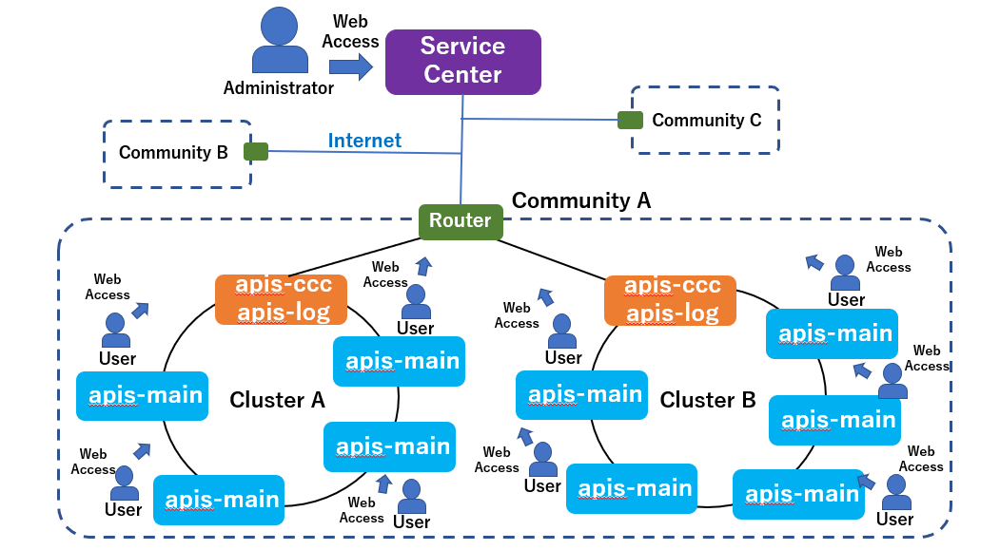
Figure 2-1

 

# **3. Software Composition**

## **3.1 Software Architecture**

The software architecture for the Service Center is illustrated in Figure 3-1. The implementation basically follows the rules of the Django framework and comprises multiple applications that provide various functions for administrators and users. The functions are accessed at different URL endpoints. The administrator and user interfaces have a standard configuration, and communication with the applications on the Service Center server is done with a Web page constructed using JavaScript and HTML styled with CSS. Web pages are provided as static sample files for single Django Service Center applications, but the static file can be cut out and deployed on any Web server, so the user interface part and the Service Center part can be placed on independent servers.

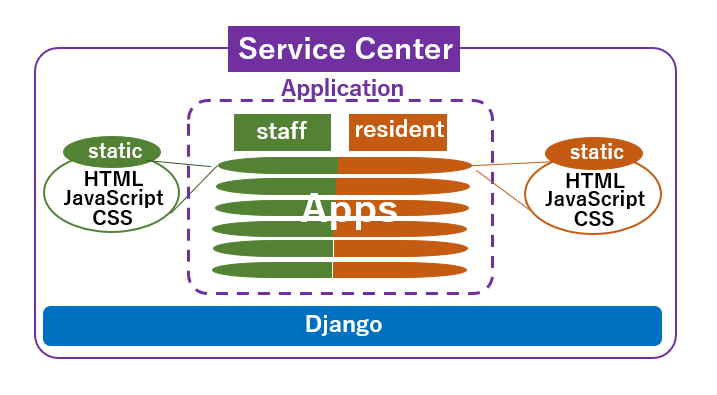
staff = administrators; resident = users  
Figure 3-1

 

## **3.2. Software Connection Configuration**

The connection diagram for the Service Center software is illustrated in Figure 3-2. Administrators can use the administration functions by accessing the administrator URLs via HTTP and entering an account name and password. Users can similarly access user functions via user URLs. After login, JavaScript is downloaded to provide functions that the administrator or user can interact with. The apis-ccc and apis-log services collect energy sharing data and execution logs from the apis-main installations in the cluster and store the data in a database. The Service Center applications access the database as needed to provide the functions to the administrator or user. (For more information on apis-main, apis-ccc, and apis-log, see their respective specification documents.)

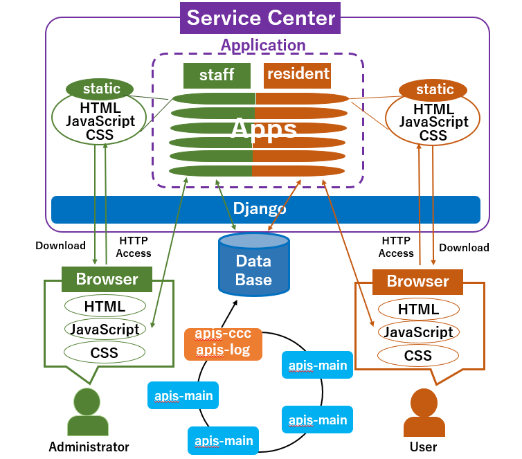  
Figure 3-2

 

# **4. User Interface**
    
## **4.1. Login Screen**

The Service Center login screen (Figure 4-1) is presented when the administrator or user URL is first accessed. To use admin functions, it is necessary to access the administrator URL and enter an administrator account name and password. Similarly, users must access the user URL and provide a user account name and password to use user functions. Once the account name and password have been entered, the browser can save the login information, so subsequent logins are more convenient.  
  
The Service Center that can be downloaded from GitHub can be accessed with the usernames and passwords listed below.
  
\[Administrator\]  
&emsp;username: admin  
&emsp;password: admin  
\[User\]  
&emsp;username: e001 (e002, e003, e004, etc.)  
&emsp;password: e001 (e002, e003, e004, etc.)

　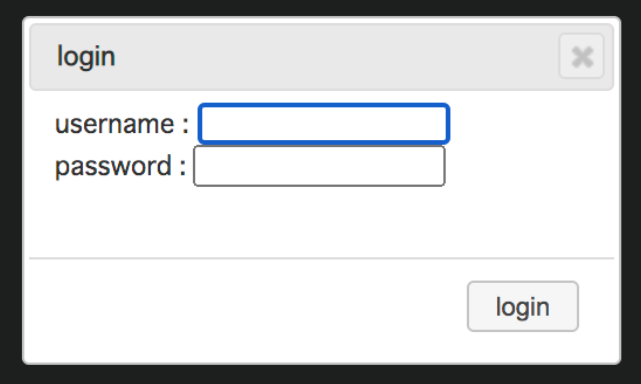  
  Figure 4-1

 

## **4.2. Administrator Screen**
    
### **4.2.1. Community and Cluster Selection**

When the admin URL is accessed, a screen is presented for selection of a community and the clusters that belong to it. Pull-down menus are provided for selecting communities and clusters. The registered information is displayed as soon as the pull-down menus for community, cluster, and unit are clicked.  
 
\*Click on a menu item to display the screen for other communities or clusters.  

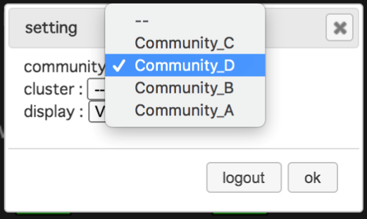  
Figure 4-2

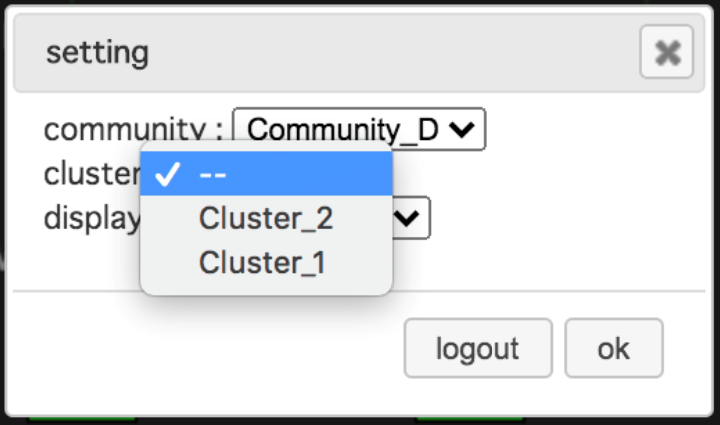  
Figure 4-3

 

### **4.2.2. Display selection**

Clicking on the “Display” pull-down menu (Figure 4-4) presents a list of the four options described below.

\[Display\]  
&emsp;\-VISUAL:  
&emsp;&emsp;Displays the energy sharing and status of each unit in real time.  
&emsp;\-AVAILABILITY:  
&emsp;&emsp;Specifying a time period produces a display of the average availability for all units for that period and the availability for each unit.  
&emsp;\-DEAL:  
&emsp;&emsp;Shows the energy sharing history for the entire cluster.  
&emsp;\-MONITORING:  
&emsp;&emsp;Presents the screen for failure management, and alive monitoring on or off for the apis-main service of each unit and for apis-ccc and apis-log, which collect data and store it in the database.  

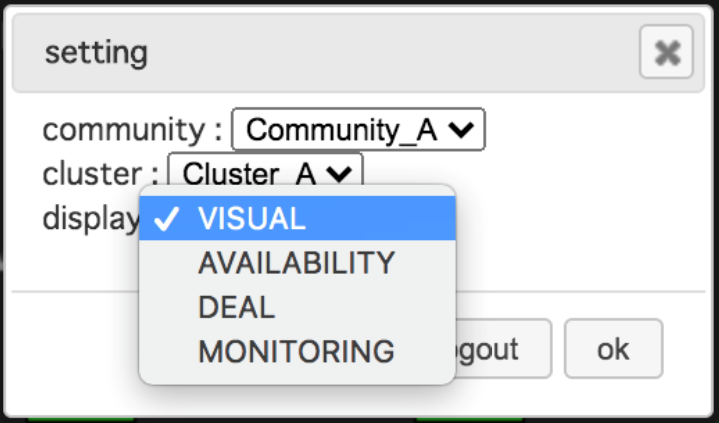  
Figure 4-4

### **4.2.3. VISUAL**

VISUAL displays the energy sharing information and status of each unit in real time. The display for four units (house001 to house004) is shown in Figure 4-5. Dotted lines connect from house002 to house001 and to house003, representing that energy sharing is in progress from house002 to both house001 and house003. The crown symbol indicates that house001 is the Grid Master. (Concerning the Grid Master and the energy sharing mechanism, refer to the apis-main Specification Document.)

The Service Center example can be downloaded from GitHub using the following URL.

http://127.0.0.1:8000/static/ui\_example/staff/visual.html

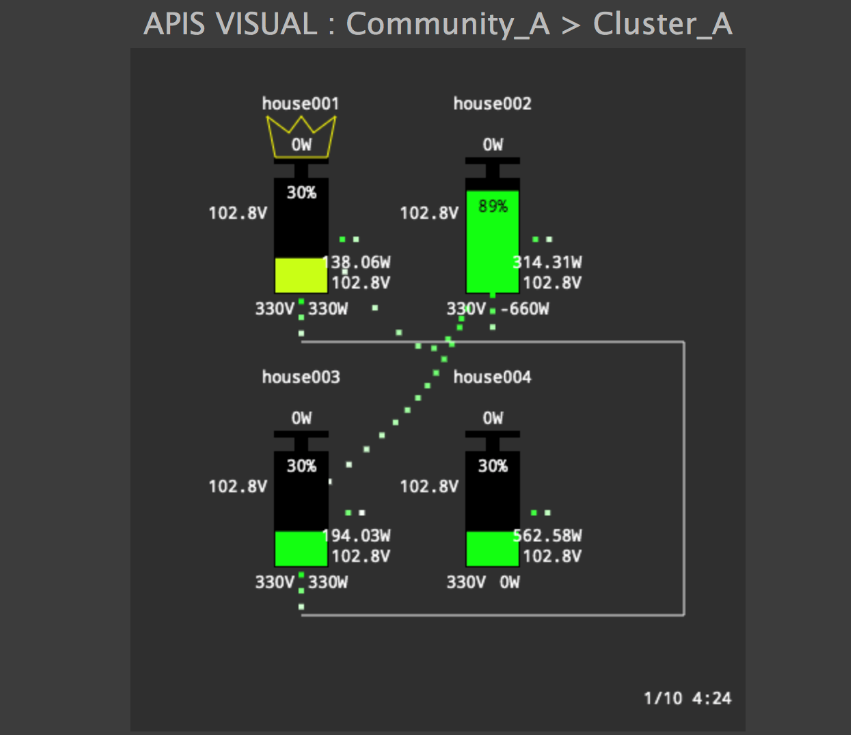  
Figure 4-5

 

### **4.2.4. AVAILABILITY**

AVAILABILITY displays the average availability for all of the units in a cluster and the availability for each unit.

Entering a time period, such as \<“2020-01-01” – “2020-01-07”\>, and clicking the “Aggregate” button results in a display of the average rates for all of the units in the first cluster in the list and the rates for each unit in the cluster (Figure 4-6).

The Service Center example can be downloaded from GitHub using the following URL.

http://127.0.0.1:8000/static/ui\_example/staff/availability.html

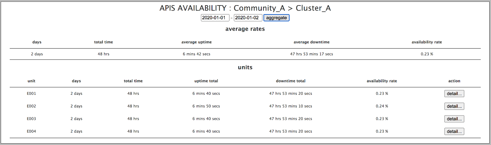  
Figure 4-6
 
 
Clicking on the “Details” button on the right side of each unit line displays the individual information for that unit (Figure 4-7).

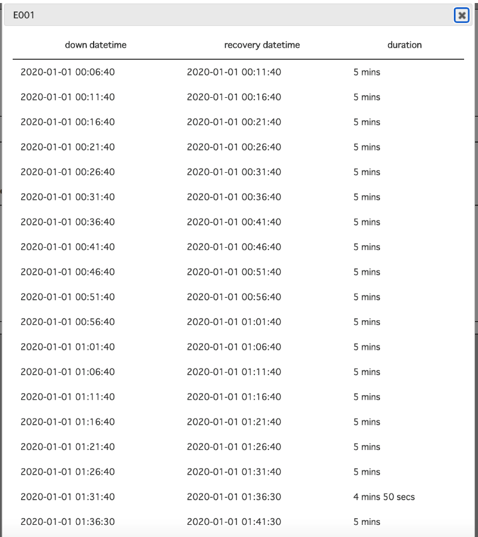  
Figure 4-7

 

### **4.2.5. DEAL**

DEAL displays the energy sharing history. When a date (E.g.: ”2020-01-01”) is entered and the “Aggregate” button is clicked, the energy sharing data for all units for each hour of that date is presented as a bar graph (Figure 4-8). The segmented line in the graph represents the averages of all units in the cluster for the power exchange period.

The Service Center example can be downloaded from GitHub using the following URL.

http://127.0.0.1:8000/static/ui_example/staff/deal.html

  
  
Figure 4-8
 
 
Clicking on the “Details” button below the summary brings up energy sharing information as shown in Figure 4-9.  
  
Figure 4-9
 
 
Clicking on the “Details” button to the right of each line of energy sharing information displays more information on that transaction (Figure 4-10).  
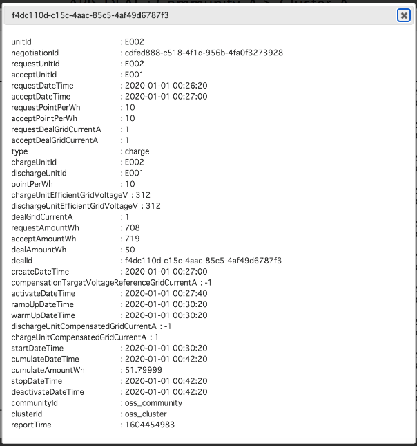  
Figure 4-10

 

### **4.2.6. MONITORING**

MONITORING displays the on/off screen for the alive monitoring and failure detection functions for the apis-main, apis-ccc, and Grid Master services in the cluster (Figure 4-11 and Figure 4-12). Alive monitoring and failure detection can be toggled on or off by checking or unchecking the checkbox on the right side of each line. Display in green indicates the ON state; display in red indicates the OFF state.

The Service Center example can be downloaded from GitHub using the following URL.

http://127.0.0.1:8000/static/ui\_example/staff/monitoring.html

  
Figure 4-11
 
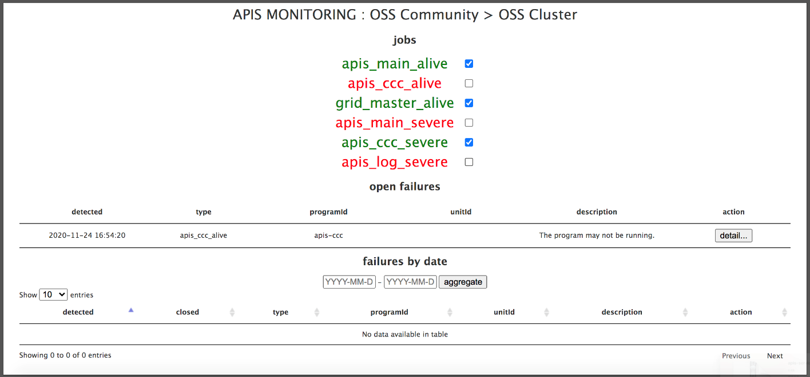  
Figure 4-12  
 
 
Clicking on the “Details” button to the right of each line of failure information displays more information on that failure (Figure 4-13).
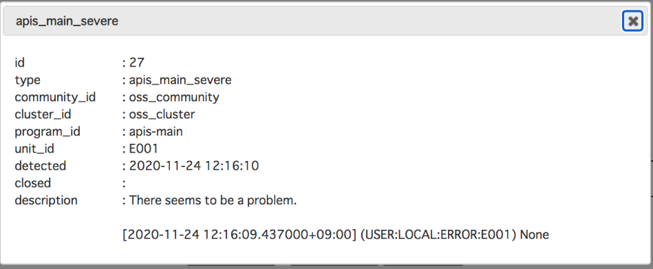  
Figure 4-13

 

## **4.3. User Screen**

### **4.3.1. Community, Cluster and Unit Selection**

When the user URL is accessed, a screen is presented for selection of a community and the clusters that belong to it in the same way as for the administrator URL. Pull-down menus are provided for selecting communities and clusters. For the user screen, there is an additional “Unit” pull-down menu for selecting a unit ID for which information will also be displayed. The registered information is displayed as soon as the pull-down menu is clicked.

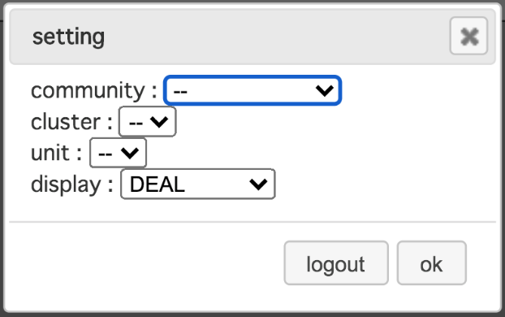  
Figure 4-14

 

### **4.3.2. Display selection**

Clicking on the “Display” pull-down menu (Figure 4-15) presents a list of the three options described below.

\[Display\]  
&emsp;\-VISUAL:  
&emsp;&emsp;Displays the energy sharing and status of the specified unit in real time.  
&emsp;\-DEAL:  
&emsp;&emsp;Displays the energy sharing history for the specified unit.  
&emsp;\-SCENARIO:  
&emsp;&emsp;Changes the operation rules that determine behavior in energy sharing.  

  
Figure 4-15

 

### **4.3.3. VISUAL**

For users, VISUAL displays the energy sharing information and status of only the user’s unit in real time. The state in which there is no energy sharing is shown on the left side of Figure 4-16 and the state in which there is energy sharing is shown on the right side. When energy sharing is displayed, only as many units for which energy sharing is in progress are shown; to protect personal information, other unit information is not shown. Energy sharing is being conducted with the two other units that appear as shadows in the image on the right side of Figure 4-16.

The Service Center example can be downloaded from GitHub using the following URL.

http://127.0.0.1:8000/static/ui\_example/resident/visual.html

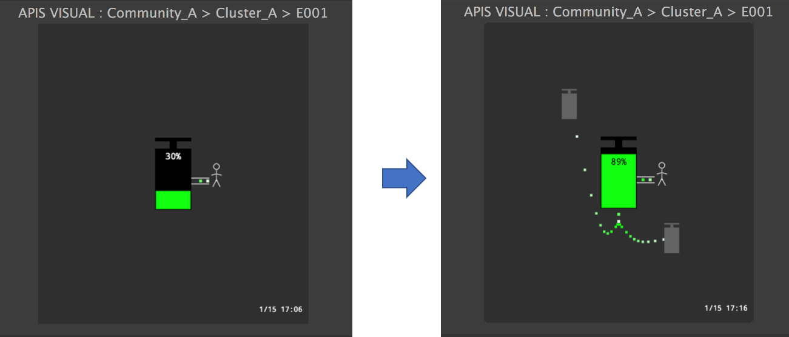  
Figure 4-16

 

### **4.3.4. DEAL**

For the user, DEAL displays the energy sharing history. When a date (E.g.: ”2020-01-01”) is entered and the “Aggregate” button is clicked, the energy sharing data for all units for each hour of that date is presented as a bar graph (Figure 4-17). The segmented line in the graph represents the averages of all units in the cluster for the power exchange period.

The Service Center example can be downloaded from GitHub using the following URL.

http://127.0.0.1:8000/static/ui\_example/resident/deal.html

  
Figure 4-17  
 
 
Clicking on the “Details” button below the summary brings up energy sharing information as shown in Figure 4-18.  
  
Figure 4-18  
 
  
Clicking on the “Details” button to the right of each line of energy sharing information displays more information on that transaction (Figure 4-19).  
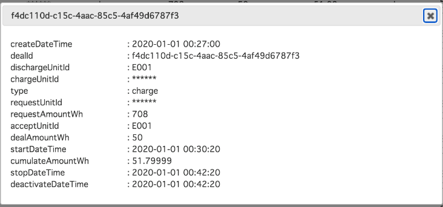  
Figure 4-19

 

### **4.3.5. SCENARIO**

SCENARIO enables the user to change the action rules that determine the behavior of the unit for energy sharing by selecting from the displayed scenarios that represent energy sharing action rules. In the example shown in Figure 4-20, four scenario options are presented, but the number of options presented can be increased by the administrator. (For information on scenario registration, see section 6, “Registration of information to the Service Center”.)

The Service Center example can be downloaded from GitHub using the following URL.

http://127.0.0.1:8000/static/ui\_example/resident/scenario.html

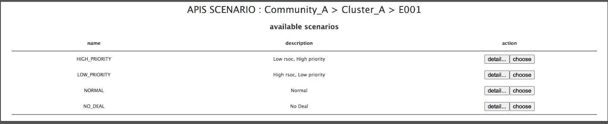  
Figure 4-20
 
 
To choose a scenario, click on the “Choose” button on the right side of the line for that scenario. Clicking on the “Detail” button allows the user to check the JSON file for the scenario (Figure 4-21). (For information on the scenario JSON files, refer to the apis-main Specification Document.)

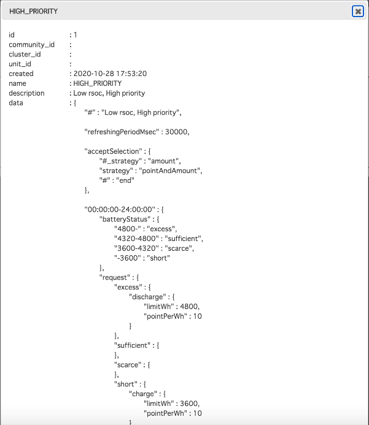  
Figure 4-21

 

# **5. Service Center Server**

## **5.1. Application Overview**

Service Center comprises the Django applications described below.

* ”api” application
  * The API bundles all the applications for publication.
* ”apis\_log” application
  * This application contains the models for apis-log and retrieves data from the MongoDB database according to requests from various applications.
* ”community” application
  * This application contains the models for community, cluster, and unit, and retrieves data from the SQLite database according to requests from various applications.
* ”core” application
  * This application manages login and logout and authenticates administrators and users.
* ”deal” application
  * This application contains the models for energy sharing deals and retrieves energy sharing data from the MongoDB database.
* ”downtime” application
  * This application contains the models for down time and retrieves unit data from the MongoDB database.
* ”monitoring” application
  * This application contains the models for failure monitoring and performs alive monitoring and failure detection based on information stored in the MongoDB database by apis-log.
* ”scenario” application
  * This application contains the models for scenarios. It retrieves the rules that determine requests and acceptances for energy sharing for each level of battery state of charge from the SQLite database and distributes that information to the apis-main of each unit.
* ”unit\_data” application
  * This application contains the models for unit data and retrieves unit data for each unit from the MongoDB database.  

 
The applications are explained in detail in the following sections.

 

## **5.2. “api” application**

The file structure for the api application is described below. (Basically, the structure follows the rules for the Django framework.)

▼static/ui\_example

Contains sample files of HTML screens for users or administrators.

* /resident
  * css  
   A folder that holds all of the CSS files for user pages.
  * js  
   A folder that holds all of the JavaScript files for user pages.
  * deal.html  
   The HTML file for the user DEAL display page.
  * scenario.html
   The HTML file for the user SCENARIO display page.
  * visual.html  
   The HTML file for the user VISUAL display page.

* /staff
  * css  
   A folder holds all of the CSS files for administrator pages.
  * js  
   A folder that holds all of the JavaScript files for administrator pages.
  * availability.html  
   The HTML file for the administrator AVAILABILITY display page.
  * deal.html  
   The HTML file for the administrator DEAL display page.
  * monitoring.html  
   The HTML file for the administrator MONITORING display page.
  * visual.html  
   The HTML file for the administrator VISUAL display page.

 

▼static/api

These are test HTML files for evaluating the client.js program. They can be used to evaluate the session function and getting data from the database.

* resident/client\_example.html
* staff/client\_example.html

 

▼templates/api

A folder that holds all of the template files for JavaScript. The placement of files for users and administrators is shown below.

* resident/client.js  
 This JavaScript file is downloaded to the user’s browser together with the JavaScript file under static/ui\_example to serve as the interface to the various Service Center applications.

* staff/client.js  
 This JavaScript file is downloaded to the user’s browser together with the JavaScript file under static/ui\_example to serve as the interface to the various Service Center applications.

 

▼urls

* \_init\_.py
  * The urls description file below the “api” application.  
   The files described in urls are located at the Web API access points listed below.

    * /api/core/xxx  
     → The urls.py file under the “core” application.
    * /api/staff/xxx  
     → The staff.py file under the urls folder below the “api” application.
    * /api/resident/xxx  
     → The resident.py file under the urls folder below the “api” application.
    * /api/misc/xxx  
     → The misc.py file under the urls folder below the “api” application.

* misc.py
  * The urls description file below the “api” application.  
   The files described in urls are located at the Web API endpoints listed below.

    * /api/misc/scenario/xxx  
     → The misc.py of the urls folder below the scenario application.

* resident.py
  * The urls description file below the “api” application.  
   The files described in urls are located at the Web API endpoints listed below.
 
    * /api/resident/client.js  
     → This renders the resident/client.js template under the “api” application.
    * /api/resident/community/xxx  
     → The resident.py file under the “community” application.
    * /api/resident/unitData/xxx  
     → The resident.py of the urls folder under the “unit\_data” application.
    * /api/resident/deal/xxx  
     → The resident.py of the urls folder under the “deal” application.
    * /api/resident/scenario/xxx
     → The resident.py of the urls folder under the “scenario” application.

* staff.py
  * The urls description file below the “api” application.  
   The files described in urls are located at the Web API endpoints listed below.

    * /api/staff/client.js
      → This renders the staff/client.js template under the “api” application.
    * /api/staff/community/xxx
      → The staff.py of the urls folder under the “community” application.
    * /api/staff/unitData/xxx
     → The staff.py of the urls folder under the “unit\_data”.
    * /api/staff/deal/xxx  
     → The staff.py of the urls folder under the “deal” application.
    * /api/staff/downtime/xxx  
     → The staff.py of the urls folder under the “downtime” application.
    * /api/staff/monitoring/xxx  
     → The staff.py of the urls folder under the “monitoring” application.

 

▼\_init\_.py  
An empty file generated automatically by the Django framework.
 

▼admin.py  
An empty file generated automatically by the Django framework.
 

▼apps.py  
This file is registered in INSTALLED\_APPS in config/settings/base.py and describes the processing executed on start-up. It defines the ApiConfig class.
 

▼modelst.py  
An empty file generated automatically by the Django framework.
 

▼tests.py  
An empty file generated automatically by the Django framework.
 

▼views.py  
An empty file generated automatically by the Django framework.

 

## **5.3. “apis\_log” application**

The file structure for the “apis\_log” application is described below. (Basically, the structure follows the rules for the Django framework.)

▼\_init\_.py  
An empty file generated automatically by the Django framework.
 

▼admin.py  
An empty file generated automatically by the Django framework.
 

▼apps.py  
This file is registered in INSTALLED\_APPS in config/settings/base.py and describes the processing executed at start-up. It defines the ApisLogConfig class.
 

▼modelst.py  
The following models are defined as classes.
* ApisLog  
 This is a model that represents the APIS execution log.  
 It specifies Community, Cluster, and Unit and conditions such as time period, retrieves information that matches the conditions from the MongoDB database, and returns the information.
 

▼tests.py  
An empty file generated automatically by the Django framework.
 

▼views.py  
An empty file generated automatically by the Django framework.
 

 

## **5.4. “community” application**

The file structure for the “community” application is shown below. (Basically, the structure follows the rules for the Django framework.)

▼fixtures

* example.json  
 This JSON file is used for batch registration of Community, Cluster, or Unit information, etc. in the SQLite database.
 

▼migrations  
This file is created automatically when migration of a model defined in model.py is performed.
 

▼urls

* resident.py  
  * The urls description file under the “community” application.  
   The following Web API access points are the locations of the functions that do the actual processing.
    * /api/resident/community/outline  
     → The resident\_outline function in the views.py file under the “community” application.

* staff.py  
  * The urls description file under the “community” application.  
   The following Web API access points are the locations of the functions that do the actual processing.
    * /api/staff/community/outline  
     → The outline function in the views.py file under the “community” application.

▼\_init\_.py  
An empty file generated automatically by the Django framework.
 

▼admin.py  
Defines the UnitAdmin class, which enables creation or editing of models defined in models.py on the admin screen.
 

▼apps.py  
Registered in the INSTALLED\_APPS of config/settings/base.py and describes the processing executed at start-up. Defines the CommunityConfig class.
 

▼models.py  
The following models are defined as classes.

* Community  
 A model that represents a community.
* Cluster  
 A model that represents a cluster.
* Unit  
 A model that represents a unit.  

The following functions are defined.

* outline
Retrieves the hierarchical structure of Community, Cluster, and Unit for the specified date. (for administrators)

* resident\_outline  
Retrieves the hierarchical structure of Community, Cluster, and Unit. (for users)
 

▼tests.py  
An empty file generated automatically by the Django framework.
 

▼views.py  

The following functions are defined.

* outline  
This is an administrator function that retrieves the hierarchical structure of Community, Cluster, and Unit for the specified date from the SQLite database and returns it in JSON format.

* resident\_outline  
 This is a user function that retrieves the hierarchical structure of Community, Cluster, and Unit from the MongoDB database and returns it in JSON format.

 

 

## **5.5. “core” application**

The file structure for the “core” application is shown below. (Basically, the structure follows the rules for the Django framework.)

▼fixtures

* example.json  
 This JSON file is used when batch-saving administrator and user information in the SQLite database.
 

▼migrations  
A file that is generated automatically upon migration of models defined in model.py.
 

▼\_init\_.py  
An empty file generated automatically by the Django framework.
 

▼admin.py  
Defines the MyUserChangeForm, and MyUserAdmin classes to enable registration ad editing of the models defined in models.py from the admin screen.
 

▼apps.py  
Registered in the INSTALLED\_APPS of config/settings/base.py and describes the processing executed at start-up. Defines the CoreConfig class.
 

▼decorators.py  

This file defines decorator functions for checking permissions for the execution of the functions defined in the application vies.py file.

* login\_required
 Execution is permitted only when logged in.

* staff\_required  
 Execution permitted only for users that have admin privileges.

* resident\_required  
 Execution is permitted only for users that have resident privileges.

* staff\_with\_community\_cluster\_required  
 Execution is permitted only when a user that has admin privileges has sent the correct Community ID and Cluster ID.

* resident\_with\_community\_cluster\_unit\_required  
 Execution is permitted only when a user that has resident privileges has sent the correct Community ID, Cluster ID,  and Unit ID.

* nosession\_community\_cluster\_unit\_required  
 Execution is permitted only when a user that has admin privileges has sent authentication information and the correct Community ID, Cluster ID, and Unit ID.
 

▼models.py  
The following classes are defined.

* User  
 Defines the user model.
 

▼mongodb.py  
The following models are defined as classes.

* MongoDBManager  
 This overrides the Django Model Manager for MongoDB
 

▼tests.py  
An empty file generated automatically by the Django framework.
 

▼urls.py  
* The urls description file under the “core” application.  
 The following Web API access points are the locations of the classes and functions that do the actual processing.

  * /api/core/login  
 → The MyLoginView class in the views.py folder of the “core” application.

  * /api/core/logout  
 →The MyLogoutView class in the views.py folder of the “core” application.

  * /api/core/session  
 → The session function in the views.py folder of the “core” application.

  * /api/core/csrftoken  
 →”The csrftoken function in the views.py folder of the “core” application.
 

▼utils.py

This file defines utility functions that are used by the various applications.

* pymongo\_no\_id\_projection  
 This performs processing to remove the \_id attribute from the result when using MongoDB via PyMongo.

* pymongo\_result\_conv  
 Converts the naïve UTC datetime value returned by PyMongo to aware.

*  parse\_iso8601\_extended  
 Parses ISO8601 format datetime strings.

* parse\_iso8601\_extended\_timezone  
 Parses ISO8601 format time zone strings.
 

▼views.py

The following classes are defined.

* MyLoginView  
 A class that performs login functions.

* MyLogoutView  
 A class that performs logout functions.

The following functions are defined.

* session  
 A function that does session processing.

* csrftoken  
 A function that performs token processing for countering CSRF.
 

 

## **5.6. “deal” application**

The file structure for the “deal” application is shown below. (Basically, the structure follows the rules for the Django framework.)

▼urls

* resident.py  
  * The urls description file under the “deal” application.　　
   The following Web API access points are the locations of the functions that do the actual　processing.

    * /api/resident/deal/liveList
     → The resident\_live\_list function in the views.py file under the “deal” application.

    * /api/resident/deal/live  
     → The resident\_list function in the views.py file under the “deal” application.

    * /api/resident/deal/datetimeRange
     → The resident\_datetime\_range function in the views.py file under the “deal” application.

    * /api/resident/deal/sumOfCumulateAmountWhsByHour  
     → The resident\_sum\_of\_cumulate\_amount\_whs\_by\_hour function in the views.py file under the “deal” application.

* staff.py
  * The urls description file under the “deal” application.  
   The following Web API access points are the locations of the functions that do the actual processing.

    * /api/staff/deal/liveList  
     → The live\_list function in the views.py file under the “deal” application.

    * /api/staff/deal/live  
     → The list function in the views.py file under the “deal” application.

    * /api/staff/deal/datetimeRange  
     → The datetime\_range function in the views.py file under the “deal” application.

    * /api/staff/deal/sumOfCumulateAmountWhsByHour
     → The sum\_of\_cumulate\_amount\_whs\_by\_hour function in the views.py file under the “deal” application.
 

▼\_init\_.py  
An empty file generated automatically by the Django framework.
 

▼admin.py  
An empty file generated automatically by the Django framework.
 

▼apps.py  
Registered in the INSTALLED\_APPS of config/settings/base.py and describes the processing executed at start-up. Defines the DealConfig class.
 

▼models.py  
The following models are defined as classes.

* Deal  
 A model that represents energy sharing information.

The following functions are defined.

* ensure\_indices
 Creates an index on a MongoDB collection.
 

▼tests.py  
An empty file generated automatically by the Django framework.

▼views.py  
The following functions are defined.

* live\_list  
 This function creates a list of information on currently running energy sharing for the cluster specified by Community ID and Cluster ID and returns the information in JSON format.

* list  
 This function creates a list of information on energy sharing that was performed for the cluster specified by Community ID and Cluster ID and returns the information in JSON format.

* datetime\_range  
 This function creates a list of information on energy sharing that was performed for the cluster specified by Community ID and Cluster ID in the specified time period and returns the information in JSON format.

* sum\_of\_cumulate\_amount\_whs\_by\_hour  
 This function creates a list of information on cumulative energy sharing for the cluster specified by Community ID and Cluster ID for each hour, and returns the information in JSON format.

* resident\_live\_list  
 This function creates a list of information on currently running energy sharing for the unit specified by Community ID, Cluster ID, and Unit ID and returns the information in JSON format.

* resident\_list  
 This function creates a list of information on energy sharing performed for the unit specified by Community ID, Cluster ID, and Unit ID and returns the information in JSON format.

* resident\_datetime\_range  
 This function creates a list of information on energy sharing that was performed for the cluster specified by Community ID, Cluster ID, and Unit ID in the specified time period and returns the information in JSON format.
 

## **5.7. “downtime” application**

The file structure for the “downtime” application is shown below. (Basically, the structure follows the rules for the Django framework.)

▼urls

* staff.py
  * The urls description file under the “downtime” application.  
   The following Web API access points are the locations of the functions that do the actual processing.

    * /api/staff/downtime/unitIdList  
     → The unit\_id\_list function in the views.py file under the “downtime” application.

    * /api/staff/downtime/list  
     → The list function in the views.py file under the “downtime” application.
 

▼\_init\_.py  
An empty file generated automatically by the Django framework.
 

▼admin.py  
An empty file generated automatically by the Django framework.
 

▼apps.py  
Registered in the INSTALLED\_APPS of config/settings/base.py and describes the processing executed at start-up. Defines the DowntimeConfig class.
 

▼job.py  
Defines functions used by the “downtime” application.

* init  
  An initialization function that creates a new thread and executes the loop function in the daemon mode.

* loop  
  A function that creates an infinite loop for execution of the \_do\_all function at the time intervals specified by DOWNTIME.interval\_sec in config/settings/base.py after initially waiting for the time specified by DOWNTIME.initial\_wait\_sec in config/settings/base.py.

* do\_all
  A function for performing downtime accumulation processing that creates a new thread and executes the \_do\_units function for all clusters of all communities.

* do\_units  
  A function for performing downtime accumulation processing that executes the \_do\_unit function for of the units in one cluster.

* do\_unit  
  A function for performing downtime accumulation processing that obtains the unit data for the unit specified by Community ID, Cluster ID, and Unit ID, and updates the downtime appropriately according to the time and apis.operation\_mode.effective attributes.

* find\_unit\_data  
  A function that retrieves the Unit Data, and if last\_time is specified, filters the data to include only the values for which the time attribute is greater than last\_time.

* get\_last\_time  
  Retrieves the time of the Unit data that was processed last.

* save\_last\_time  
  Saves the time of the Unit data that was processed last.

* get\_active\_down\_datetime  
  Retrieves the active downtime that has no recoveryDataTime.

* save\_active\_down\_datetime  
  Saves the active downtime that has no recoveryDataTime.

* save\_recovery\_datetime  
  Saves recoveryDataTime and terminates the active downtime.

* handle\_exception  
  Describes processing for when exceptions are thrown in program execution.
 

▼models.py  
The following models are defined as classes.

* Downtime  
 A model that represents “downtime”.

Defines a method that returns the downtime that matches specified conditions.

* DowntimeStatus  
 A model that represents the state of cumulative “downtime” processing.

Defines a method that returns a list of unit IDs that possess a processing state.

The following functions are defined.

* ensure\_indices
  Creates an index on a MongoDB collection.
 

▼tests.py  
An empty file generated automatically by the Django framework.
 

▼views.py  
The following functions are defined.

* unit\_id\_list
  This function creates a list of unit IDs for the cluster specified by Community ID and Cluster ID that have a processing state and returns the list in JSON format.

* list  
  This function creates a list of downtimes filtered by time period for the unit specified by Community ID, Cluster ID, and Unit ID and returns the list in JSON format.
 

 

## **5.8. “monitoring” application**

The file structure for the “monitoring” application is shown below. (Basically, the structure follows the rules for the Django framework.)

▼job  
Jobs perform alive monitoring and failure detection based on information from the MongoDB for apis-main, apis-ccc, and other such software.

  * \_init\_.py  
    The init function of job/\_init\_.py is executed when the Service Center server is run by specifying the MonitoringConfig class in apps.py in the INSTALLED\_APPS of config/settings/base.py. The init function executes the Invoker class of each job instance in the background.

  * abstract.py  
    Defines Invoker, Monitor, Notifier parent classes that inherit from Django framework Thread.

  * apis\_ccc\_alive.py  
    Defines the parent alive Monitor class that inherits from the Invoker, Monitor, and Notifier classes of abstract.py and is used by apis-ccc for alive monitoring.

  * apis\_ccc\_severe.py  
    Defines the parent failure detection Monitor class that inherits from the Invoker, Monitor, and Notifier classes of abstract.py and is used by apis-ccc for failure detection monitoring.

  * apis\_log\_severe.py  
    Defines the parent alive Monitor class that inherits from the Invoker, Monitor, and Notifier classes of abstract.py and is used by apis-log for alive monitoring.

  * apis\_main\_alive.py  
    Defines the parent alive Monitor class that inherits from the Invoker, Monitor, and Notifier classes of abstract.py and is used by apis-main for alive monitoring.

  * apis\_main\_severe.py  
    Defines the parent failure detection Monitor class that inherits from the Invoker, Monitor, and Notifier classes of abstract.py and is used by apis-main for failure detection monitoring.

  * config.py  
    Defines functions used by the monitoring application.

  * grid\_master\_alive.py  
    Defines the alive Monitor class that inherits from the Invoker, Monitor, and Notifier classes of abstract.py and is used by the Grid Master.

▼migrations  
This file is generated automatically when migration of a model defined in model.py is performed.
 

▼urls  

* staff.py
  * The urls description file under the “monitoring” application.
   The following Web API access points are the locations of the functions that do the actual processing.

    * /api/staff/monitoring/failure/openList  
     → The failure\_open\_list function in the views.py file under the “monitoring” application.

    * /api/staff/monitoring/failure/list  
     → The failure\_list function in the views.py file under the “monitoring” application.

    * /api/staff/monitoring/job/list  
     → The job\_list function in the views.py file under the “monitoring” application.

    * /api/staff/monitoring/job/activate  
     → The job\_set\_is\_active (is\_active=True) function in the views.py file under the “monitoring” application.

    * /api/staff/monitoring/job/deactivate  
     → The job\_set\_is\_active(is\_active=False) function in the views.py file under the “monitoring” application.
 

▼\_init\_.py  
An empty file generated automatically by the Django framework.
 

▼admin.py  
 Defines the FailureAdmin, CommunitySettingAdmin, and JobSettingAdmin classes, which enable creation or editing of models defined in models.py on the admin screen.
 

▼apps.py  
Registered in the INSTALLED\_APPS of config/settings/base.py and describes the processing executed at start-up. Defines the MonitoringConfig class.
 

▼models.py  
The following models are defined as classes.

* Failure  
 A model representing failures.

* CommunitySetting  
 A model representing the settings for a community.

* JobSetting  
 A model representing settings for monitoring processing for a cluster.
 

▼tests.py  
An empty file generated automatically by the Django framework.
 

▼views.py  

The following functions are defined.

* failure\_open\_list  
  This function creates an open list of failure information for the cluster specified by Community ID and Cluster ID and returns the information in JSON format.

* failure\_list  
  This function creates a list of information on failures for the cluster specified by Community ID and Cluster ID filtered by time period and returns the information in JSON format.

* job\_list  
 This function creates a list of active jobs for the cluster specified by Community ID and Cluster ID and returns the information in JSON format.

* job\_set\_is\_active  
 This function sets jobs in a cluster specified by Community ID and Cluster ID to active or inactive.
 

 

## **5.9. “scenario” application**

The file structure for the “scenario” application is shown below. (Basically, the structure follows the rules for the Django framework.)

▼fixtures

* example.json
 A JSON file that is used for batch registration of scenario data in an SQLite database.
 

▼migrations  
This file is created automatically when migration of a model defined in model.py is performed.
 

▼urls

* misc.py
  * A urls description file under the “scenario” application.
   The following Web API access points are the locations of the functions that do the actualprocessing.

    * /api/apis/scenario/currentData  
     → The misc\_current\_data function in the views.py file under the “scenario”application.

    * /api/apis/scenario/update  
     → The misc\_update function in the views.py file under the “scenario” application.

* resident.py  
  * A urls description file under the “scenario” application.
   The following Web API access points are the locations of the functions that do the actual　processing.

    * /api/resident/scenario/availableList
     → The resident\_availableList function in the views.py file under the “scenario” application.

    * /api/resident/scenario/current
     → The resident\_current function in the views.py file under the “scenario” application.

    * /api/resident/scenario/choose
     → The resident\_choose function in the views.py file under the “scenario” application.
 

▼\_init\_.py  
An empty file generated automatically by the Django framework.
 

▼admin.py  
 Defines the ScenarioAdmin and ChoiceAdmin classes, which enable creation or editing of models defined in models.py on the admin screen.
 

▼apps.py  
 Registered in the INSTALLED\_APPS of config/settings/base.py and describes the processing executed at start-up. Defines the ScenarioConfig class.
 

▼models.py  

The following models are defined as classes.

* Scenario  
 A model that represents scenarios.

* Choice  
 A model that represents scenario options.
 

▼tests.py  
An empty file generated automatically by the Django framework.

▼views.py  

The following functions are defined.

* resident\_availableList  
 A function that returns scenario information that can be selected for the specified unit.

* resident\_current  
  A function that returns the scenario information that is currently selected for the specified unit.

* resident\_choose  
 Selects the scenario for the specified unit.  
 Selects the scenario for the unit specified by scenarioId.  
 If not specified, sets the unselected state.

* misc\_current\_update  
 Returns the actual data part of the currently selected scenario for the specified unit.

* misc\_update  
 Registers the dedicated scenario for the specified unit.
 

 

## **5.10. “unit\_data” application**

The file structure for the “unit\_data” application is shown below. (Basically, the structure follows the rules for the Django framework.)

▼urls

* resident.py  
  * The urls description file under the “unit\_data” application.  
   The following Web API access points are the locations of the functions that do the actual processing.

    * /api/resident/unit\_data/latestSet  
     → The resident\_latest\_set function in the views.py file under the “unit\_data” application.

* staff.py
  * The urls description file under the “unit\_data” application.  
   The following Web API access points are the locations of the functions that do the actual processing.

    * /api/staff/unit\_data/unitIdList  
     → The unit\_id\_list function in the views.py file under the “unit\_data” application.”

    * /api/staff/unit\_data/latestSet  
     → The latest\_set function in the views.py file under the “unit\_data” application.”
 

▼\_init\_.py  
An empty file generated automatically by the Django framework.
 

▼admin.py  
An empty file generated automatically by the Django framework.
 

▼apps.py  
Registered in the INSTALLED\_APPS of config/settings/base.py and describes the processing executed at start-up. Defines the UnitDataConfig class.
 

▼models.py  

The following models are defined as classes.

* UnitData  
 A model that represents Unit Data.

The following functions are defined.

* ensure\_indices  
 Creates an index on a MongoDB collection.
 

▼tests.py  
An empty file generated automatically by the Django framework.
 

▼views.py  

The following functions are defined.

* unit\_id\_list  
 Returns a list of IDs for the unit data of the specified community and cluster.

* latest\_set  
  Returns the latest set of Unit Data for the specified community and cluster in JSON format.

* resident\_latest\_set  
 Returns the latest set of Unit Data for the specified unit in JSON format.

* to\_resident\_format  
 Converts Unit Data to the format for users.
 

 

# **6. Registration to the Service Center**

The registration of communities, clusters, units and users to the Service Center is explained in this section.

Access 127.0.0.1:8000/admin to bring up the Django administration screen shown below.

  
Figure 6-1
 
 
“Groups” under “AUTHENTIFICATION AND AUTHORIZATION” is the default setting for Django and enables various restriction on access to each type of data. For this Service Center, however, use of that function is not assumed.  
To register a new community, select “Communities” under “COMMUNNITY” to bring up the screen shown below and then enter the appropriate information as described below.  
&emsp;For “Code:” enter the same “communityId” as is specified in the config.json file for apis-main.    
&emsp;Name: Enter freely.

  
Figure 6-2
 
 
To register a new cluster, select “Clusters” under “COMMUNNITY” to bring up the screen shown below and then enter the appropriate information as described below.  
&emsp;For “Community:”, select the name of a community created with “Communities”.  
&emsp;For “Code:”, enter the same “clusterId” as is specified in the config.json file for apis-main.  
&emsp;Name: Enter freely.

  
Figure 6-3
 
 
To register a new unit, select “Units” under “COMMUNNITY” to bring up the screen shown below and then enter the appropriate information as described below.  
&emsp;For “Cluster:”, select the name of a cluster created with “Clusters”.  
&emsp;For “Code:”, enter the same “unitId” as is specified in the config.json file for apis-main.  
&emsp;Name: Enter freely.  
&emsp;For “Available from:”, enter the date on which use of the unit is to begin. (Optional)  
&emsp;&emsp;&emsp;&emsp;&emsp;&emsp;&emsp;&emsp;&emsp;&emsp;(This is relevant to downtime, etc.)  
&emsp;For “Available to:”, enter the date on which use of the unit is to end. (Optional)  
&emsp;&emsp;&emsp;&emsp;&emsp;&emsp;&emsp;&emsp;&emsp;&emsp;(This is relevant to downtime, etc.)  
&emsp;Users: Select a user to associate with the unit. (Optional)  
&emsp;&emsp;&emsp;&emsp;&emsp;&emsp;&emsp;&emsp;&emsp;&emsp;(User registration is explained below.)

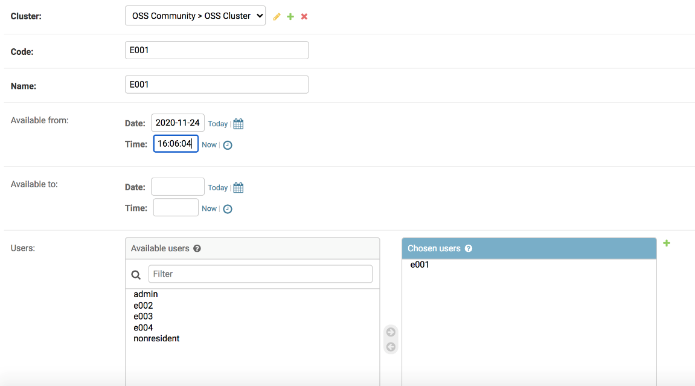  
Figure 6-4
 
 
To register a new administrator or user, select “Users” under “CORE” to bring up the screen shown below and then enter the appropriate information as described below.  
&emsp;Username: Enter freely.  
&emsp;Password: Enter freely.

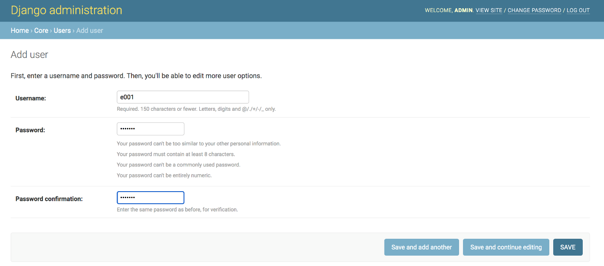  
Figure 6-5
 
 
When finished, click on the “SAVE” button to bring up the screen shown below.  
To create an administrator account, check the “Staff status” item.  

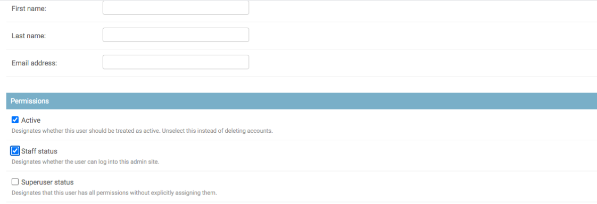  
Figure 6-6
 
 
To register a new email address for notification of failures within a community, select “Community Setting” under “MONITORING” to bring up the screen shown below.  
&emsp;For “Community Id:”, select a community code that was created with “Communities”.  
&emsp;For “Notify to:”, enter an email address at which to receive notification of failures.  

  
Figure 6-7
 
 
To view a list of failures, select “Failures” under “MONITORING” to bring up the screen shown below. It is possible to display all of the failure information for all communities and all clusters at one time, but considering the huge amount of data, filtering as shown below is available.

  
Figure 6-8
 
 
To display a list of failures, select “Job settings” under “MONITORING” to bring up the screen shown below, which enables you to set registered job functions such as alive processing and failure detection on or off. This is the same as the ON/OFF function that can be accessed at the following URL.  

http://127.0.0.1:8000/static/ui\_example/staff/monitoring.html

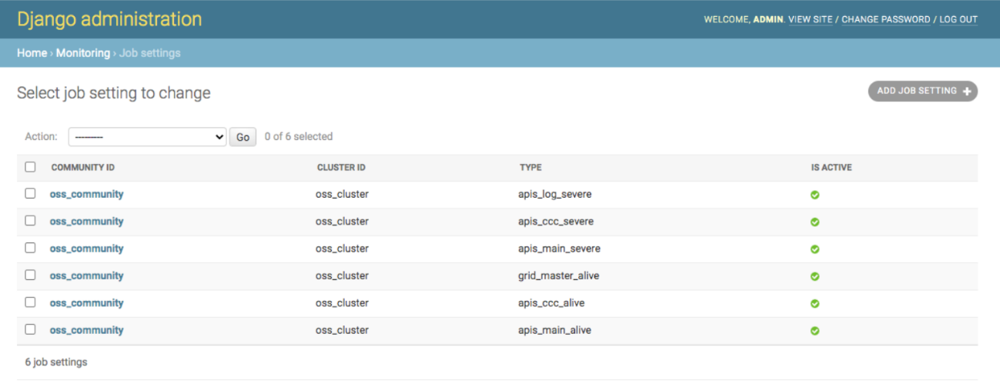  
Figure 6-9
 
 
To select a scenario for each unit, select “Choices” under “SCENARIO” to bring up the screen shown below.  
&emsp;For “Community Id:”, select the code of a community that was created with “Communities”.  
&emsp;For “Cluster Id:”, enter the code of a cluster that was created with “Communities”.  
&emsp;For “Unit Id:”, enter the code of a unit that was created with “Communities”.  
&emsp;Created: Enter the date.  
&emsp;Scenario: Select a registered scenario.

  
Figure 6-10
 
 
To register a new scenario, select “Scenarios” under “SCENARIO” to bring up the screen shown below.

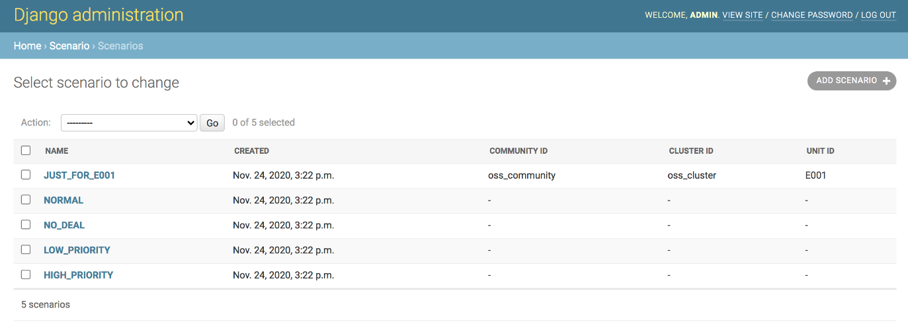  
Figure 6-11
 
 
Click on the “ADD SCENARIO” button to bring up the screen shown below.  
&emsp;For “Community Id:”, select the code of a community that was created with “Communities”. (\*1)  
&emsp;For “Cluster Id:”, enter the code of a cluster that was created with “Communities”. (\*1)  
&emsp;For “Unit Id:”, enter the code of a unit that was created with “Communities”. (\*1)  
&emsp;Created: Enter the date.  
&emsp;Name: Enter the name of the new scenario.  
&emsp;Description: Enter a description of the scenario.  
&emsp;Data: Enter the scenario in JSON format.  
&emsp;&emsp;&emsp;&emsp;&emsp;&emsp;&emsp;&emsp;(For how to create a scenario, refer to the sample and the apis-main Specification Document.)

(\*1) If not specified, can be used by all units.  
&emsp;If communityId only is specified, can be used by all of the units in that community.  
&emsp;If communityId and clusterId are specified, can be used by all of the units in that cluster.  
&emsp;If communityId, clusterId, and unitId are specified, can be used only by that unit.

  
Figure 6-12
 

 

# **7. Communication Specifications**
    
## **7.1. Service Center Web API**

The Web API can be used for information exchange with Service Center. The specifications are explained below. (The reverse proxy path of the Web server is indicated by “/”.)  
The GitHub sample can be accessed by adding the URL of the Web API after “http://127.0.0.1:8000/”.  
Only the Web API endpoints listed below are accessed by the POST method; all others are accessed by the GET method. A POST leads to an example of access by curl; a GET leads to an example of access by Web browser.  
(For a GET access with curl rather than with a Web browser, -H ‘Cookie: sessionid=xxxxxx’ is required.)

 

&emsp;/api/core/login  
&emsp;/api/misc/scenario/currentData  
&emsp;/api/misc/scenario/update

 

<table>
<tbody>
<tr class="odd">
<td>/api/core/login</td>
<td>
Performs login processing for administrators and users.

&lt; Access example &gt;

(When a POST method is used, entry from a terminal is assumed.)

Access the following URL and get the csrftoken and csrminddle from the cookie.

 curl -i '<a href="http://localhost:8000/api/core/csrftoken">http://localhost:8000/api/core/csrftoken</a>' 

Then, execute the following command.

curl -i 'http://localhost:8000/api/core/login' -H 'Cookie: csrftoken=xxxxxx' -F 'username=oes' -F 'password=oes' -F 'csrfmiddlewaretoken=xxxxxxxx'
</td>
</tr>
<tr class="even">
<td>/api/core/logout</td>
<td>
Performs logout processing for administrators and users.

(It is not possible to log out without having logged in and passed the session token.)

&lt; Access example &gt;

http://127.0.0.1:8000/api/core/logout

&lt; Return example &gt;

　None
</td>
</tr>
<tr class="odd">
<td>/api/core/session</td>
<td>
Perform the Web session processing for Service Center.

&lt; Access example &gt;

A GitHub sample can be accessed with the following URL.

http://127.0.0.1:8000/api/core/session

&lt; Return example &gt;

{

&quot;sessionid&quot;: &quot;gs0vyzrs6puevlus2kw072t0y3vdnjwf&quot;,

&quot;expiry_age&quot;: 1209600,

&quot;expiry_date&quot;: &quot;2020-12-07T13:42:42.274Z&quot;,

&quot;user&quot;: {

&quot;username&quot;: &quot;admin&quot;,

&quot;last_name&quot;: &quot;&quot;,

&quot;first_name&quot;: &quot;&quot;,

&quot;email&quot;: &quot;&quot;

}

}
</td>
</tr>
<tr class="even">
<td>/api/core/csrftoken</td>
<td>
Performs token processing to counter CSRF.

&lt; Access example &gt;

A GitHub sample can be accessed with the following URL.

http://127.0.0.1:8000/api/core/csrftoken

&lt; Return example &gt;

{

&quot;csrfmiddlewaretoken&quot;: &quot;xxxxxxxxxxxxxxxxxxxx&quot;

}
</td>
</tr>
<tr class="odd">
<td>/api/staff/client.js</td>
<td>
A JavaScript program that is downloaded to the browser of an administrator to serve as an interface with the various Service Center applications.

&lt; Access example &gt;

A GitHub sample can be accessed with the following URL.

http://127.0.0.1:8000/api/staff/client.js

&lt; Return example &gt;

Refer to /api/staff/client.js
</td>
</tr>
<tr class="even">
<td>/api/staff/community/outline</td>
<td>
[Admin Web API]

Retrieves the hierarchical structure of communities, clusters, and units for the specified date and time from the MongoDB database and returns the result in JSON format.

&lt; Access example &gt;

A GitHub sample can be accessed with the following URL.

http://127.0.0.1:8000/api/staff/community

/outline

&lt; Return example &gt;

{

&quot;communities&quot;: {

&quot;oss_community&quot;: {

&quot;id&quot;: &quot;oss_community&quot;,

&quot;name&quot;: &quot;OSS Community&quot;,

&quot;clusters&quot;: {

&quot;oss_cluster&quot;: {

&quot;communityId&quot;: &quot;oss_community&quot;,

&quot;id&quot;: &quot;oss_cluster&quot;,

&quot;name&quot;: &quot;OSS Cluster&quot;,

&quot;units&quot;: {

&quot;E001&quot;: {

&quot;communityId&quot;: &quot;oss_community&quot;,

&quot;clusterId&quot;: &quot;oss_cluster&quot;,

&quot;id&quot;: &quot;E001&quot;,

&quot;name&quot;: &quot;E001&quot;,

&quot;available_from&quot;: null,

&quot;available_to&quot;: null

},

&quot;E002&quot;: {

&quot;communityId&quot;: &quot;oss_community&quot;,

&quot;clusterId&quot;: &quot;oss_cluster&quot;,

&quot;id&quot;: &quot;E002&quot;,

&quot;name&quot;: &quot;E002&quot;,

&quot;available_from&quot;: null,

&quot;available_to&quot;: null

},

}

}

}

}
</td>
</tr>
<tr class="odd">
<td>/api/staff/unitData/unitIdList</td>
<td>
[Admin Web API]

Returns a list of IDs for the unit data specified by Community ID and Cluster ID and returns it in JSON format.

&lt; Access example &gt;

A GitHub sample can be accessed with the following URL.

http://127.0.0.1:8000/api/staff/unitData/unitIdList

?communityId=oss_community

&amp;clusterId=oss_cluster

&lt; Return example &gt;

[

&quot;E001&quot;,

&quot;E002&quot;

]
</td>
</tr>
<tr class="even">
<td>/api/staff/unitData/latestSet</td>
<td>
[Admin Web API]

Returns the most recent set of unit data for the specified unit in JSON format.

&lt; Access example &gt;

A GitHub sample can be accessed with the following URL.

http://127.0.0.1:8000/api/staff/unitData/latestSet

?communityId=oss_community

&amp;clusterId=oss_cluster

&lt; Return example &gt;

{

&quot;E001&quot;: {

&quot;emu&quot;: {

&quot;charge_discharge_power&quot;: 299.2,

&quot;system_time&quot;: {

&quot;month&quot;: 12,

&quot;minute&quot;: 5,

&quot;day&quot;: 20,

&quot;hour&quot;: 23,

&quot;year&quot;: 2014

},

&quot;pvc_charge_current&quot;: 0,

&quot;ups_input_voltage&quot;: 102.8,

&quot;rsoc&quot;: 46.56,

&quot;battery_current&quot;: -6.23,

&quot;battery_voltage&quot;: 52.1,

&quot;pvc_charge_voltage&quot;: 0.28,

&quot;ups_operation_mode&quot;: {

&quot;parameter&quot;: 80,

&quot;mode&quot;: 2,

&quot;stop_mode&quot;: 2

},

&quot;ups_operation_schedule&quot;: 1,

&quot;ups_output_power&quot;: 130.0,

&quot;battery_rsoc&quot;: 34,

&quot;ups_output_frequency&quot;: 60,

&quot;pvc_charge_power&quot;: 0.0,

&quot;ups_output_current&quot;: 11.7,

&quot;dischargeable_time&quot;: {

&quot;minute&quot;: 0,

&quot;hour&quot;: 0

},

&quot;ups_output_voltage&quot;: 102.8

},

&quot;dcdc&quot;: {

&quot;status&quot;: {

&quot;status&quot;: &quot;0x0000&quot;,

&quot;alarmState&quot;: &quot;Light alarm&quot;,

&quot;operationMode&quot;: &quot;Waiting&quot;

},

&quot;meter&quot;: {

&quot;wg&quot;: 0,

&quot;tmp&quot;: 26.59,

&quot;vb&quot;: 48,

&quot;wb&quot;: -4.5,

&quot;vg&quot;: 0,

&quot;ib&quot;: -0.09,

&quot;ig&quot;: 0

},

&quot;vdis&quot;: {

&quot;dvg&quot;: 350.0,

&quot;drg&quot;: 0.0

},

&quot;param&quot;: {

&quot;dig&quot;: 0.0

}

},

&quot;oesunit&quot;: {

&quot;communityId&quot;: &quot;oss_community&quot;,

&quot;clusterId&quot;: &quot;oss_cluster&quot;,

&quot;id&quot;: &quot;E001&quot;,

&quot;display&quot;: &quot;E001&quot;,

&quot;sn&quot;: &quot;1&quot;,

&quot;budo&quot;: &quot;1&quot;,

&quot;ip&quot;: &quot;169.254.209.84&quot;,

&quot;ipv6_ll&quot;: &quot;NA&quot;,

&quot;ipv6_g&quot;: &quot;NA&quot;,

&quot;mac&quot;: &quot;8c:85:90:b2:14:ef&quot;

},

&quot;time&quot;: &quot;2019-12-31T20:36:10Z&quot;,

&quot;battery&quot;: {

&quot;rsoc&quot;: 46.56,

&quot;battery_operation_status&quot;: null

},

&quot;apis&quot;: {

&quot;version&quot;: &quot;3.0.0&quot;,

&quot;remaining_capacity_wh&quot;: 2234,

&quot;deal_interlock_capacity&quot;: 2,

&quot;is_grid_master&quot;: true,

&quot;operation_mode&quot;: {

&quot;global&quot;: &quot;autonomous&quot;,

&quot;local&quot;: null,

&quot;effective&quot;: &quot;autonomous&quot;

}

},

&quot;datasetId&quot;: 1606189298143

},

}
</td>
</tr>
<tr class="odd">
<td>/api/staff/deal/liveList</td>
<td>
[Admin Web API]

Returns a list of energy sharing data for energy sharing that is currently in progress in the cluster specified by Community ID and Cluster ID and returns the list in JSON format.

&lt; Access example &gt;

A GitHub sample can be accessed with the following URL.

http://127.0.0.1:8000/api/staff/deal/liveList

?communityId=oss_community

&amp;clusterId=oss_cluster

&lt; Return example &gt;

[

{

&quot;unitId&quot;: &quot;E003&quot;,

&quot;negotiationId&quot;: &quot;d2db0d7a-5836-4a13-90bf-416ab4654a2c&quot;,

&quot;requestUnitId&quot;: &quot;E003&quot;,

&quot;acceptUnitId&quot;: &quot;E001&quot;,

&quot;requestDateTime&quot;: &quot;2020-01-01T06:05:40Z&quot;,

&quot;acceptDateTime&quot;: &quot;2020-01-01T06:05:40Z&quot;,

&quot;requestPointPerWh&quot;: 10.0,

&quot;acceptPointPerWh&quot;: 10.0,

&quot;requestDealGridCurrentA&quot;: 1.0,

&quot;acceptDealGridCurrentA&quot;: 1.0,

&quot;type&quot;: &quot;charge&quot;,

&quot;chargeUnitId&quot;: &quot;E003&quot;,

&quot;dischargeUnitId&quot;: &quot;E001&quot;,

&quot;pointPerWh&quot;: 10.0,

&quot;chargeUnitEfficientGridVoltageV&quot;: 312.0,

&quot;dischargeUnitEfficientGridVoltageV&quot;: 312.0,

&quot;dealGridCurrentA&quot;: 1.0,

&quot;requestAmountWh&quot;: 1358,

&quot;acceptAmountWh&quot;: 536,

&quot;dealAmountWh&quot;: 50,

&quot;dealId&quot;: &quot;f6f9743d-d6f0-4611-a5c9-b166c43acf95&quot;,

&quot;createDateTime&quot;: &quot;2020-01-01T06:05:40Z&quot;,

&quot;compensationTargetVoltageReferenceGridCurrentA&quot;: -2.0,

&quot;activateDateTime&quot;: &quot;2020-01-01T06:09:10Z&quot;,

&quot;warmUpDateTime&quot;: &quot;2020-01-01T06:09:10Z&quot;,

&quot;dischargeUnitCompensatedGridCurrentA&quot;: -1.0,

&quot;chargeUnitCompensatedGridCurrentA&quot;: 1.0,

&quot;startDateTime&quot;: &quot;2020-01-01T06:09:10Z&quot;,

&quot;cumulateDateTime&quot;: &quot;2020-01-01T06:10:50Z&quot;,

&quot;cumulateAmountWh&quot;: 7.1944447,

&quot;communityId&quot;: &quot;oss_community&quot;,

&quot;clusterId&quot;: &quot;oss_cluster&quot;,

&quot;reportTime&quot;: 1606138146

}

]
</td>
</tr>
<tr class="even">
<td>/api/staff/deal/list</td>
<td>
[Admin Web API]

Returns a list of energy sharing data for energy sharing performed in the cluster specified by Community ID and Cluster ID and returns the list in JSON format (also filtered for the time period specified by datetimeFrom and datatimeTo).

&lt; Access example &gt;

A GitHub sample can be accessed with the following URL.

http://127.0.0.1:8000/api/staff/deal/list

?communityId=oss_community

&amp;clusterId=oss_cluster

&lt; Return example &gt;

[

{

&quot;unitId&quot;: &quot;E004&quot;,

&quot;negotiationId&quot;: &quot;592f2616-4c5e-4c40-a364-589b9c054221&quot;,

&quot;requestUnitId&quot;: &quot;E004&quot;,

&quot;acceptUnitId&quot;: &quot;E001&quot;,

&quot;requestDateTime&quot;: &quot;2019-12-31T15:19:10Z&quot;,

&quot;acceptDateTime&quot;: &quot;2019-12-31T15:18:30Z&quot;,

&quot;requestPointPerWh&quot;: 10.0,

&quot;acceptPointPerWh&quot;: 10.0,

&quot;requestDealGridCurrentA&quot;: 1.0,

&quot;acceptDealGridCurrentA&quot;: 1.0,

&quot;type&quot;: &quot;charge&quot;,

&quot;chargeUnitId&quot;: &quot;E004&quot;,

&quot;dischargeUnitId&quot;: &quot;E001&quot;,

&quot;pointPerWh&quot;: 10.0,

&quot;chargeUnitEfficientGridVoltageV&quot;: 312.0,

&quot;dischargeUnitEfficientGridVoltageV&quot;: 312.0,

&quot;dealGridCurrentA&quot;: 1.0,

&quot;requestAmountWh&quot;: 646,

&quot;acceptAmountWh&quot;: 716,

&quot;dealAmountWh&quot;: 50,

&quot;dealId&quot;: &quot;95bafe56-76b7-403f-8e6d-7f6e9af55d21&quot;,

&quot;createDateTime&quot;: &quot;2019-12-31T15:19:10Z&quot;,

&quot;compensationTargetVoltageReferenceGridCurrentA&quot;: -2.0,

&quot;activateDateTime&quot;: &quot;2019-12-31T15:22:50Z&quot;,

&quot;warmUpDateTime&quot;: &quot;2019-12-31T15:22:50Z&quot;,

&quot;dischargeUnitCompensatedGridCurrentA&quot;: -1.0,

&quot;chargeUnitCompensatedGridCurrentA&quot;: 1.0,

&quot;startDateTime&quot;: &quot;2019-12-31T15:22:50Z&quot;,

&quot;cumulateDateTime&quot;: &quot;2019-12-31T15:34:30Z&quot;,

&quot;cumulateAmountWh&quot;: 50.361103,

&quot;stopDateTime&quot;: &quot;2019-12-31T15:34:30Z&quot;,

&quot;deactivateDateTime&quot;: &quot;2019-12-31T15:34:30Z&quot;,

&quot;communityId&quot;: &quot;oss_community&quot;,

&quot;clusterId&quot;: &quot;oss_cluster&quot;,

&quot;reportTime&quot;: 1606056822

}

]
</td>
</tr>
<tr class="odd">
<td>/api/staff/deal/datetimeRange</td>
<td>
[Admin Web API]

Returns a list of time periods for the dates and times when energy sharing was performed in the cluster specified by Community ID and Cluster ID, and returns the data in JSON format.

&lt; Access example &gt;

A GitHub sample can be accessed with the following URL.

http://127.0.0.1:8000/api/staff/deal/datetimeRange

?communityId=oss_community

&amp;clusterId=oss_cluster

&lt; Return example &gt;

{

&quot;min&quot;: &quot;2019-12-31T15:19:10Z&quot;,

&quot;max&quot;: &quot;2020-01-09T09:08:10Z&quot;

}
</td>
</tr>
</thead>
<tbody>
<tr class="even">
<td>
/api/staff/deal/

sumOfCumulateAmountWhsByHour
</td>
<td>
[Admin Web API]

Returns a list of the cumulative amounts of energy sharing data by the hour in the cluster specified by Community ID and Cluster ID, and returns the data in JSON format.

&lt; Access example &gt;

A GitHub sample can be accessed with the following URL.

http://127.0.0.1:8000/api/staff/deal

/sumOfCumulateAmountWhsByHour

?communityId=oss_community

&amp;clusterId=oss_cluster&amp;timezone=%2B09%3A00

&lt; Return example &gt;

{

&quot;0&quot;: 306.48328000000004,

&quot;1&quot;: 107.983345,

&quot;6&quot;: 215.96669,

&quot;7&quot;: 107.983345,

&quot;9&quot;: 316.74445000000003,

&quot;10&quot;: 1427.327889,

&quot;11&quot;: 414.934751,

&quot;12&quot;: 8.180555,

&quot;15&quot;: 107.49028799999999,

&quot;16&quot;: 315.454191,

&quot;17&quot;: 1481.980689,

&quot;18&quot;: 1947.715443,

&quot;19&quot;: 1184.748663

}
</td>
</tr>
<tr class="odd">
<td>/api/staff/downtime/unitIdList</td>
<td>
[Admin Web API]

This creates a list of IDs of units in the cluster specified by Community ID and Cluster ID, and have the processing status for the time period. It returns the list in JSON format.

&lt; Access example &gt;

A GitHub sample can be accessed with the following URL.

http://127.0.0.1:8000/api/staff/downtime

/unitIdList?communityId=oss_community

&amp;clusterId=oss_cluster&amp;datetimeFrom

=2020-01-01T15%3A00%3A00.000Z

<blockquote>

&amp;datetimeTo=2020-01-02T15%3A00%3A00.000Z

</blockquote>

&lt; Return example &gt;

[

&quot;E001&quot;,

&quot;E002&quot;,

&quot;E003&quot;,

&quot;E004&quot;

]
</td>
</tr>
<tr class="even">
<td>/api/staff/downtime/list</td>
<td>
[Admin Web API]

Returns a list of downtimes for the cluster specified by Community ID, Cluster ID, and time period and returns the list in JSON format.

&lt; Access example &gt;

A GitHub sample can be accessed with the following URL.

http://127.0.0.1:8000/api/staff/downtime

/list?communityId=oss_community

&amp;clusterId=oss_cluster&amp;datetimeFrom

=2020-01-01T15%3A00%3A00.000Z

&amp;datetimeTo=2020-01-02T15%3A00%3A00.000Z

&lt; Return example &gt;

[

{

&quot;clusterId&quot;: &quot;oss_cluster&quot;,

&quot;communityId&quot;: &quot;oss_community&quot;,

&quot;recoveryDateTime&quot;: &quot;2019-12-31T15:12:20Z&quot;,

&quot;unitId&quot;: &quot;E001&quot;,

&quot;downDateTime&quot;: &quot;2019-12-31T15:07:20Z&quot;

},

{

&quot;clusterId&quot;: &quot;oss_cluster&quot;,

&quot;communityId&quot;: &quot;oss_community&quot;,

&quot;recoveryDateTime&quot;: &quot;2019-12-31T15:12:20Z&quot;,

&quot;unitId&quot;: &quot;E004&quot;,

&quot;downDateTime&quot;: &quot;2019-12-31T15:07:20Z&quot;

}

]

</blockquote></td>
</tr>
<tr class="odd">
<td>/api/staff/monitoring/failure/openList</td>
<td>
[Admin Web API]

Returns a list of open failure information for the cluster specified by Community ID and Cluster ID and returns the list in JSON format.

&lt; Access example &gt;

A GitHub sample can be accessed with the following URL.

http://127.0.0.1:8000/api/staff/monitoring

/failure/openList?communityId=oss_community

&amp;clusterId=oss_cluster

&lt; Return example &gt;

[

{

&quot;id&quot;: 53,

&quot;type&quot;: &quot;apis_ccc_alive&quot;,

&quot;community_id&quot;: &quot;oss_community&quot;,

&quot;cluster_id&quot;: &quot;oss_cluster&quot;,

&quot;program_id&quot;: &quot;apis-ccc&quot;,

&quot;unit_id&quot;: null,

&quot;detected&quot;: &quot;2020-11-24T03:27:51.696Z&quot;,

&quot;closed&quot;: null,

&quot;description&quot;: &quot;The program may not be running.&quot;

}

]
</td>
</tr>
<tr class="even">
<td>/api/staff/monitoring/failure/list</td>
<td>
[Admin Web API]

Returns a list of all failure data specified by Community ID and Cluster ID and returns the list in JSON format (also filtered for the time period specified by datetimeFrom and datatimeTo).

&lt; Access example &gt;

A GitHub sample can be accessed with the following URL.

http://127.0.0.1:8000/api/staff/monitoring

/failure/list?communityId=oss_community

&amp;clusterId=oss_cluster

&lt; Return example &gt;

[

{

&quot;id&quot;: 6,

&quot;type&quot;: &quot;apis_ccc_alive&quot;,

&quot;community_id&quot;: &quot;oss_community&quot;,

&quot;cluster_id&quot;: &quot;oss_cluster&quot;,

&quot;program_id&quot;: &quot;apis-ccc&quot;,

&quot;unit_id&quot;: null,

&quot;detected&quot;: &quot;2020-11-23T15:42:17.781Z&quot;,

&quot;closed&quot;: &quot;2020-11-24T03:08:09.412Z&quot;,

&quot;description&quot;: &quot;The program may not be running.&quot;

}

]
</td>
</tr>
<tr class="odd">
<td>/api/staff/monitoring/job/list</td>
<td>
[Admin Web API]

Creates a list of Active/ Inactive Units in the cluster specified by Community ID and Cluster ID, and returns the list in JSON format.

&lt; Access example &gt;

A GitHub sample can be accessed with the following URL.

http://127.0.0.1:8000/api/staff/monitoring

/job/list?communityId=oss_community

&amp;clusterId=oss_cluster

&lt; Return example &gt;

[

{

&quot;type&quot;: &quot;apis_main_alive&quot;,

&quot;isActive&quot;: true

},

{

&quot;type&quot;: &quot;apis_ccc_alive&quot;,

&quot;isActive&quot;: false

},

{

&quot;type&quot;: &quot;apis_ccc_severe&quot;,

&quot;isActive&quot;: true

},

{

&quot;type&quot;: &quot;apis_log_severe&quot;,

&quot;isActive&quot;: false

}

]
</td>
</tr>
<tr class="even">
<td>/api/staff/monitoring/job/activate</td>
<td>
[Admin Web API]

Sets the jobs in the cluster specified by Community ID and Cluster ID to Active.

&lt; Access example &gt;

A GitHub sample can be accessed with the following URL.

http://127.0.0.1:8000/api/staff/monitoring

/job/activate?communityId=oss_community

&amp;clusterId=oss_cluster&amp;type=apis_ccc_severe

&lt; Return example &gt;

OK
</td>
</tr>
<tr class="odd">
<td>/api/staff/monitoring/job/deactivate</td>
<td>
[Admin Web API]

Sets the jobs in the cluster specified by Community ID and Cluster ID to Inactive

&lt;E.g.&gt;

A GitHub sample can be accessed with the following URL.

http://127.0.0.1:8000/api/staff/monitoring

/job/deactivate?communityId=oss_community

&amp;clusterId=oss_cluster&amp;type=apis_ccc_severe

&lt; Return example &gt;

OK
</td>
</tr>
<tr class="even">
<td>/api/resident/client.js</td>
<td>
[User WebAPI]

A JavaScript program that is downloaded to the browser of a user to serve as an interface with the various Service Center applications.

&lt; Access example &gt;

A GitHub sample can be accessed with the following URL.

http://127.0.0.1:8000/api/resident/client.js

&lt; Return example &gt;

Refer to /api/resident/client.js
</td>
</tr>
<tr class="odd">
<td>/api/resident/community/outline</td>
<td>
[User WebAPI]

Retrieves the hierarchical structure of communities, clusters, and units for the specified date and time from the MongoDB database and returns the result in JSON format.

&lt; Access example &gt;

A GitHub sample can be accessed with the following URL.

http://127.0.0.1:8000/api/resident/community

/outline

&lt; Return example &gt;

{

&quot;communities&quot;: {

&quot;oss_community&quot;: {

&quot;id&quot;: &quot;oss_community&quot;,

&quot;name&quot;: &quot;OSS Community&quot;,

&quot;clusters&quot;: {

&quot;oss_cluster&quot;: {

&quot;communityId&quot;: &quot;oss_community&quot;,

&quot;id&quot;: &quot;oss_cluster&quot;,

&quot;name&quot;: &quot;OSS Cluster&quot;,

&quot;units&quot;: {

&quot;E001&quot;: {

&quot;communityId&quot;: &quot;oss_community&quot;,

&quot;clusterId&quot;: &quot;oss_cluster&quot;,

&quot;id&quot;: &quot;E001&quot;,

&quot;name&quot;: &quot;E001&quot;,

&quot;available_from&quot;: null,

&quot;available_to&quot;: null

}

}

}
</td>
</tr>
<tr class="even">
<td>/api/resident/unitData/latestSet</td>
<td>
[User WebAPI]

Returns the most recent set of unit data for the specified unit in JSON format.

&lt; Access example &gt;

A GitHub sample can be accessed with the following URL.

http://127.0.0.1:8000/api/resident/unitData

/latestSet?communityId=oss_community

&amp;clusterId=oss_cluster&amp;unitId=E001

&lt; Return example &gt;

{

&quot;E001&quot;: {

&quot;emu&quot;: {

&quot;charge_discharge_power&quot;: 22.8,

&quot;system_time&quot;: {

&quot;month&quot;: 12,

&quot;minute&quot;: 5,

&quot;day&quot;: 20,

&quot;hour&quot;: 23,

&quot;year&quot;: 2014

},

&quot;pvc_charge_current&quot;: 0,

&quot;ups_input_voltage&quot;: 102.8,

&quot;rsoc&quot;: 29.99,

&quot;battery_current&quot;: -0.48,

&quot;battery_voltage&quot;: 52.1,

&quot;pvc_charge_voltage&quot;: 0.28,

&quot;ups_operation_mode&quot;: {

&quot;parameter&quot;: 80,

&quot;mode&quot;: 5,

&quot;stop_mode&quot;: 2

},

&quot;ups_operation_schedule&quot;: 1,

&quot;ups_output_power&quot;: 130.0,

&quot;battery_rsoc&quot;: 34,

&quot;ups_output_frequency&quot;: 60,

&quot;pvc_charge_power&quot;: 0.0,

&quot;ups_output_current&quot;: 11.7,

&quot;dischargeable_time&quot;: {

&quot;minute&quot;: 0,

&quot;hour&quot;: 0

},

&quot;ups_output_voltage&quot;: 102.8

},

&quot;dcdc&quot;: {

&quot;status&quot;: {

&quot;status&quot;: &quot;0x0000&quot;,

&quot;alarmState&quot;: &quot;Light alarm&quot;,

&quot;operationMode&quot;: &quot;Waiting&quot;

},

&quot;meter&quot;: {

&quot;wg&quot;: 0,

&quot;tmp&quot;: 26.59,

&quot;vb&quot;: 48,

&quot;wb&quot;: -4.5,

&quot;vg&quot;: 0,

&quot;ib&quot;: -0.09,

&quot;ig&quot;: 0

},

&quot;vdis&quot;: {

&quot;dvg&quot;: 350.0,

&quot;drg&quot;: 0.0

},

&quot;param&quot;: {

&quot;dig&quot;: 0.0

}

},

&quot;oesunit&quot;: {

&quot;communityId&quot;: &quot;oss_community&quot;,

&quot;clusterId&quot;: &quot;oss_cluster&quot;,

&quot;id&quot;: &quot;E001&quot;,

&quot;display&quot;: &quot;E001&quot;,

&quot;sn&quot;: &quot;1&quot;,

&quot;budo&quot;: &quot;1&quot;,

&quot;ip&quot;: &quot;192.168.3.36&quot;,

&quot;ipv6_ll&quot;: &quot;NA&quot;,

&quot;ipv6_g&quot;: &quot;NA&quot;,

&quot;mac&quot;: &quot;f0:23:b9:60:09:21&quot;

},

&quot;time&quot;: &quot;2020-01-01T15:37:40Z&quot;,

&quot;battery&quot;: {

&quot;rsoc&quot;: 29.99,

&quot;battery_operation_status&quot;: null

},

&quot;apis&quot;: {

&quot;version&quot;: &quot;3.0.0&quot;,

&quot;remaining_capacity_wh&quot;: 1439,

&quot;deal_interlock_capacity&quot;: 2,

&quot;is_grid_master&quot;: true,

&quot;operation_mode&quot;: {

&quot;global&quot;: &quot;autonomous&quot;,

&quot;local&quot;: null,

&quot;effective&quot;: &quot;autonomous&quot;

}

},

&quot;datasetId&quot;: 1606141567737

}

}
</td>
</tr>

<tr class="odd">
<td>/api/resident/deal/liveList</td>
<td>
[User WebAPI]

Returns a list of energy sharing data for energy sharing that is currently in progress in the unit specified by Community ID, Cluster ID and Unit ID, and returns the list in JSON format.

&lt; Access example &gt;

A GitHub sample can be accessed with the following URL.

http://127.0.0.1:8000/api/resident/unitData

/liveList?communityId=oss_community

&amp;clusterId=oss_cluster&amp;unitId=E001

&lt; Return example &gt;

[

{

&quot;createDateTime&quot;: &quot;2020-01-01T17:23:10Z&quot;,

&quot;dealId&quot;: &quot;41044395-bde7-46e6-acce-0bbd447f3dbf&quot;,

&quot;dischargeUnitId&quot;: &quot;E001&quot;,

&quot;chargeUnitId&quot;: &quot;******&quot;,

&quot;type&quot;: &quot;charge&quot;,

&quot;requestUnitId&quot;: &quot;******&quot;,

&quot;requestAmountWh&quot;: 1420,

&quot;acceptUnitId&quot;: &quot;E001&quot;,

&quot;dealAmountWh&quot;: 50,

&quot;startDateTime&quot;: &quot;2020-01-01T17:26:40Z&quot;,

&quot;cumulateAmountWh&quot;: 7.1944447

},
</td>
</tr>
<tr class="even">
<td>/api/resident/deal/list</td>
<td>
[User WebAPI]

Returns a list of energy sharing data for energy sharing that was performed in the unit specified by Community ID, Cluster ID and Unit ID, and returns the list in JSON format (also filtered for the time period specified by datetimeFrom and datatimeTo).

&lt; Access example &gt;

A GitHub sample can be accessed with the following URL.

http://127.0.0.1:8000/api/resident/unitData

/list?communityId=oss_community

&amp;clusterId=oss_cluster&amp;unitId=E001

&lt; Return example &gt;

[

{

&quot;createDateTime&quot;: &quot;2019-12-31T15:19:10Z&quot;,

&quot;dealId&quot;: &quot;95bafe56-76b7-403f-8e6d-7f6e9af55d21&quot;,

&quot;dischargeUnitId&quot;: &quot;E001&quot;,

&quot;chargeUnitId&quot;: &quot;******&quot;,

&quot;type&quot;: &quot;charge&quot;,

&quot;requestUnitId&quot;: &quot;******&quot;,

&quot;requestAmountWh&quot;: 646,

&quot;acceptUnitId&quot;: &quot;E001&quot;,

&quot;dealAmountWh&quot;: 50,

&quot;startDateTime&quot;: &quot;2019-12-31T15:22:50Z&quot;,

&quot;cumulateAmountWh&quot;: 50.361103,

&quot;stopDateTime&quot;: &quot;2019-12-31T15:34:30Z&quot;,

&quot;deactivateDateTime&quot;: &quot;2019-12-31T15:34:30Z&quot;

}

]
</td>
</tr>
<tr class="odd">
<td>/api/resident/scenario/availableList</td>
<td>
[User WebAPI]

Returns a list of the scenarios that can be used by the unit specified by Community ID, Cluster ID, and Unit ID, and returns the list in JSON format.

&lt; Access example &gt;

A GitHub sample can be accessed with the following URL.

http://127.0.0.1:8000/api/resident/scenario

/availableList?communityId=oss_community

&amp;clusterId=oss_cluster&amp;unitId=E002

&lt; Return example &gt;

[

{

&quot;id&quot;: 1,

&quot;community_id&quot;: null,

&quot;cluster_id&quot;: null,

&quot;unit_id&quot;: null,

&quot;created&quot;: &quot;2020-11-26T04:26:59.166Z&quot;,

&quot;name&quot;: &quot;HIGH_PRIORITY&quot;,

&quot;description&quot;: &quot;Low rsoc, High priority&quot;,

&quot;data&quot;: &quot;{ &emsp;\&quot;#\&quot;: \&quot;Low rsoc, High priority\&quot;,  &emsp;\&quot;refreshingPeriodMsec\&quot;: 30000,  &emsp;\&quot;acceptSelection\&quot;: { &emsp;&emsp;\&quot;#_strategy\&quot;: \&quot;amount\&quot;, &emsp;&emsp;\&quot;strategy\&quot;: \&quot;pointAndAmount\&quot;, &emsp;&emsp;\&quot;#\&quot;: \&quot;end\&quot; &emsp;},  &emsp;\&quot;00:00:00-24:00:00\&quot;: { &emsp;&emsp;\&quot;batteryStatus\&quot;: { &emsp;&emsp;&emsp;\&quot;4800-\&quot;: \&quot;excess\&quot;, &emsp;&emsp;&emsp;\&quot;4320-4800\&quot;: \&quot;sufficient\&quot;, &emsp;&emsp;&emsp;\&quot;3600-4320\&quot;: \&quot;scarce\&quot;, &emsp;&emsp;&emsp;\&quot;-3600\&quot;: \&quot;short\&quot; &emsp;&emsp;}, &emsp;&emsp;\&quot;request\&quot;: { &emsp;&emsp;&emsp;\&quot;excess\&quot;: { &emsp;&emsp;&emsp;&emsp;\&quot;discharge\&quot;: { &emsp;&emsp;&emsp;&emsp;&emsp;\&quot;limitWh\&quot;: 4800, &emsp;&emsp;&emsp;&emsp;&emsp;\&quot;pointPerWh\&quot;: 10 &emsp;&emsp;&emsp;&emsp;} &emsp;&emsp;&emsp;}, &emsp;&emsp;&emsp;\&quot;sufficient\&quot;: { &emsp;&emsp;&emsp;}, &emsp;&emsp;&emsp;\&quot;scarce\&quot;: { &emsp;&emsp;&emsp;}, &emsp;&emsp;&emsp;\&quot;short\&quot;: { &emsp;&emsp;&emsp;&emsp;\&quot;charge\&quot;: { &emsp;&emsp;&emsp;&emsp;&emsp;\&quot;limitWh\&quot;: 3600, &emsp;&emsp;&emsp;&emsp;&emsp;\&quot;pointPerWh\&quot;: 10 &emsp;&emsp;&emsp;&emsp;} &emsp;&emsp;&emsp;} &emsp;&emsp;}, &emsp;&emsp;\&quot;accept\&quot;: { &emsp;&emsp;&emsp;\&quot;excess\&quot;: { &emsp;&emsp;&emsp;&emsp;\&quot;discharge\&quot;: { &emsp;&emsp;&emsp;&emsp;&emsp;\&quot;limitWh\&quot;: 4320, &emsp;&emsp;&emsp;&emsp;&emsp;\&quot;pointPerWh\&quot;: 10 &emsp;&emsp;&emsp;&emsp;} &emsp;&emsp;&emsp;}, &emsp;&emsp;&emsp;\&quot;sufficient\&quot;: { &emsp;&emsp;&emsp;&emsp;\&quot;discharge\&quot;: { &emsp;&emsp;&emsp;&emsp;&emsp;\&quot;limitWh\&quot;: 4320, &emsp;&emsp;&emsp;&emsp;&emsp;\&quot;pointPerWh\&quot;: 10 &emsp;&emsp;&emsp;&emsp;} &emsp;&emsp;&emsp;}, &emsp;&emsp;&emsp;\&quot;scarce\&quot;: { &emsp;&emsp;&emsp;&emsp;\&quot;charge\&quot;: { &emsp;&emsp;&emsp;&emsp;&emsp;\&quot;limitWh\&quot;: 4320, &emsp;&emsp;&emsp;&emsp;&emsp;\&quot;pointPerWh\&quot;: 10 &emsp;&emsp;&emsp;&emsp;} &emsp;&emsp;&emsp;}, &emsp;&emsp;&emsp;\&quot;short\&quot;: { &emsp;&emsp;&emsp;&emsp;\&quot;charge\&quot;: { &emsp;&emsp;&emsp;&emsp;&emsp;\&quot;limitWh\&quot;: 4320, &emsp;&emsp;&emsp;&emsp;&emsp;\&quot;pointPerWh\&quot;: 10 &emsp;&emsp;&emsp;&emsp;} &emsp;&emsp;&emsp;} &emsp;&emsp;} &emsp;},  &emsp;\&quot;#\&quot;: \&quot;end\&quot; }&quot;

},

{

&quot;id&quot;: 2,

&quot;community_id&quot;: null,

&quot;cluster_id&quot;: null,

&quot;unit_id&quot;: null,

&quot;created&quot;: &quot;2020-11-26T04:26:59.167Z&quot;,

&quot;name&quot;: &quot;LOW_PRIORITY&quot;,

&quot;description&quot;: &quot;High rsoc, Low priority&quot;,

&quot;data&quot;: &quot;{ &emsp;\&quot;#\&quot;: \&quot;High rsoc, Low priority\&quot;,  &emsp;\&quot;refreshingPeriodMsec\&quot;: 30000,  &emsp;\&quot;acceptSelection\&quot;: { &emsp;&emsp;\&quot;#_strategy\&quot;: \&quot;amount\&quot;, &emsp;&emsp;\&quot;strategy\&quot;: \&quot;pointAndAmount\&quot;, &emsp;&emsp;\&quot;#\&quot;: \&quot;end\&quot; &emsp;},  &emsp;\&quot;00:00:00-24:00:00\&quot;: { &emsp;&emsp;\&quot;batteryStatus\&quot;: { &emsp;&emsp;&emsp;\&quot;3600-\&quot;: \&quot;excess\&quot;, &emsp;&emsp;&emsp;\&quot;2400-3600\&quot;: \&quot;sufficient\&quot;, &emsp;&emsp;&emsp;\&quot;0-2400\&quot;: \&quot;scarce\&quot;, &emsp;&emsp;&emsp;\&quot;-0\&quot;: \&quot;short\&quot; &emsp;&emsp;}, &emsp;&emsp;\&quot;request\&quot;: { &emsp;&emsp;&emsp;\&quot;excess\&quot;: { &emsp;&emsp;&emsp;&emsp;\&quot;discharge\&quot;: { &emsp;&emsp;&emsp;&emsp;&emsp;\&quot;limitWh\&quot;: 2400, &emsp;&emsp;&emsp;&emsp;&emsp;\&quot;pointPerWh\&quot;: 10 &emsp;&emsp;&emsp;&emsp;} &emsp;&emsp;&emsp;}, &emsp;&emsp;&emsp;\&quot;sufficient\&quot;: { &emsp;&emsp;&emsp;}, &emsp;&emsp;&emsp;\&quot;scarce\&quot;: { &emsp;&emsp;&emsp;}, &emsp;&emsp;&emsp;\&quot;short\&quot;: { &emsp;&emsp;&emsp;&emsp;\&quot;charge\&quot;: { &emsp;&emsp;&emsp;&emsp;&emsp;\&quot;limitWh\&quot;: 2400, &emsp;&emsp;&emsp;&emsp;&emsp;\&quot;pointPerWh\&quot;: 10 &emsp;&emsp;&emsp;&emsp;} &emsp;&emsp;&emsp;} &emsp;&emsp;}, &emsp;&emsp;\&quot;accept\&quot;: { &emsp;&emsp;&emsp;\&quot;excess\&quot;: { &emsp;&emsp;&emsp;&emsp;\&quot;discharge\&quot;: { &emsp;&emsp;&emsp;&emsp;&emsp;\&quot;limitWh\&quot;: 2400, &emsp;&emsp;&emsp;&emsp;&emsp;\&quot;pointPerWh\&quot;: 10 &emsp;&emsp;&emsp;&emsp;} &emsp;&emsp;&emsp;}, &emsp;&emsp;&emsp;\&quot;sufficient\&quot;: { &emsp;&emsp;&emsp;&emsp;\&quot;discharge\&quot;: { &emsp;&emsp;&emsp;&emsp;&emsp;\&quot;limitWh\&quot;: 2400, &emsp;&emsp;&emsp;&emsp;&emsp;\&quot;pointPerWh\&quot;: 10 &emsp;&emsp;&emsp;&emsp;} &emsp;&emsp;&emsp;}, &emsp;&emsp;&emsp;\&quot;scarce\&quot;: { &emsp;&emsp;&emsp;&emsp;\&quot;charge\&quot;: { &emsp;&emsp;&emsp;&emsp;&emsp;\&quot;limitWh\&quot;: 3600, &emsp;&emsp;&emsp;&emsp;&emsp;\&quot;pointPerWh\&quot;: 10 &emsp;&emsp;&emsp;&emsp;} &emsp;&emsp;&emsp;}, &emsp;&emsp;&emsp;\&quot;short\&quot;: { &emsp;&emsp;&emsp;&emsp;\&quot;charge\&quot;: { &emsp;&emsp;&emsp;&emsp;&emsp;\&quot;limitWh\&quot;: 3600, &emsp;&emsp;&emsp;&emsp;&emsp;\&quot;pointPerWh\&quot;: 10 &emsp;&emsp;&emsp;&emsp;} &emsp;&emsp;&emsp;} &emsp;&emsp;} &emsp;},  &emsp;\&quot;#\&quot;: \&quot;end\&quot; }&quot;

}

]
</td>
</tr>
<tr class="odd">
<td>/api/resident/scenario/current</td>
<td>
[User WebAPI]

Returns a list of the scenarios that are currently selected for the unit specified by Community ID, Cluster ID, and Unit ID, and returns the list in JSON format.

&lt; Access example &gt;

A GitHub sample can be accessed with the following URL.

http://127.0.0.1:8000/api/resident/scenario

/current?communityId=oss_community

&amp;clusterId=oss_cluster&amp;unitId=E002

&lt; Return example &gt;

{

&quot;id&quot;: 1,

&quot;community_id&quot;: null,

&quot;cluster_id&quot;: null,

&quot;unit_id&quot;: null,

&quot;created&quot;: &quot;2020-11-26T04:26:59.166Z&quot;,

&quot;name&quot;: &quot;HIGH_PRIORITY&quot;,

&quot;description&quot;: &quot;Low rsoc, High priority&quot;,

&quot;data&quot;: &quot;{ &emsp;\&quot;#\&quot;: \&quot;Low rsoc, High priority\&quot;,  &emsp;\&quot;refreshingPeriodMsec\&quot;: 30000,  &emsp;\&quot;acceptSelection\&quot;: { &emsp;&emsp;\&quot;#_strategy\&quot;: \&quot;amount\&quot;, &emsp;&emsp;\&quot;strategy\&quot;: \&quot;pointAndAmount\&quot;, &emsp;&emsp;\&quot;#\&quot;: \&quot;end\&quot; &emsp;},  &emsp;\&quot;00:00:00-24:00:00\&quot;: { &emsp;&emsp;\&quot;batteryStatus\&quot;: { &emsp;&emsp;&emsp;\&quot;4800-\&quot;: \&quot;excess\&quot;, &emsp;&emsp;&emsp;\&quot;4320-4800\&quot;: \&quot;sufficient\&quot;, &emsp;&emsp;&emsp;\&quot;3600-4320\&quot;: \&quot;scarce\&quot;, &emsp;&emsp;&emsp;\&quot;-3600\&quot;: \&quot;short\&quot; &emsp;&emsp;}, &emsp;&emsp;\&quot;request\&quot;: { &emsp;&emsp;&emsp;\&quot;excess\&quot;: { &emsp;&emsp;&emsp;&emsp;\&quot;discharge\&quot;: { &emsp;&emsp;&emsp;&emsp;&emsp;\&quot;limitWh\&quot;: 4800, &emsp;&emsp;&emsp;&emsp;&emsp;\&quot;pointPerWh\&quot;: 10 &emsp;&emsp;&emsp;&emsp;} &emsp;&emsp;&emsp;}, &emsp;&emsp;&emsp;\&quot;sufficient\&quot;: { &emsp;&emsp;&emsp;}, &emsp;&emsp;&emsp;\&quot;scarce\&quot;: { &emsp;&emsp;&emsp;}, &emsp;&emsp;&emsp;\&quot;short\&quot;: { &emsp;&emsp;&emsp;&emsp;\&quot;charge\&quot;: { &emsp;&emsp;&emsp;&emsp;&emsp;\&quot;limitWh\&quot;: 3600, &emsp;&emsp;&emsp;&emsp;&emsp;\&quot;pointPerWh\&quot;: 10 &emsp;&emsp;&emsp;&emsp;} &emsp;&emsp;&emsp;} &emsp;&emsp;}, &emsp;&emsp;\&quot;accept\&quot;: { &emsp;&emsp;&emsp;\&quot;excess\&quot;: { &emsp;&emsp;&emsp;&emsp;\&quot;discharge\&quot;: { &emsp;&emsp;&emsp;&emsp;&emsp;\&quot;limitWh\&quot;: 4320, &emsp;&emsp;&emsp;&emsp;&emsp;\&quot;pointPerWh\&quot;: 10 &emsp;&emsp;&emsp;&emsp;} &emsp;&emsp;&emsp;}, &emsp;&emsp;&emsp;\&quot;sufficient\&quot;: { &emsp;&emsp;&emsp;&emsp;\&quot;discharge\&quot;: { &emsp;&emsp;&emsp;&emsp;&emsp;\&quot;limitWh\&quot;: 4320, &emsp;&emsp;&emsp;&emsp;&emsp;\&quot;pointPerWh\&quot;: 10 &emsp;&emsp;&emsp;&emsp;} &emsp;&emsp;&emsp;}, &emsp;&emsp;&emsp;\&quot;scarce\&quot;: { &emsp;&emsp;&emsp;&emsp;\&quot;charge\&quot;: { &emsp;&emsp;&emsp;&emsp;&emsp;\&quot;limitWh\&quot;: 4320, &emsp;&emsp;&emsp;&emsp;&emsp;\&quot;pointPerWh\&quot;: 10 &emsp;&emsp;&emsp;&emsp;} &emsp;&emsp;&emsp;}, &emsp;&emsp;&emsp;\&quot;short\&quot;: { &emsp;&emsp;&emsp;&emsp;\&quot;charge\&quot;: { &emsp;&emsp;&emsp;&emsp;&emsp;\&quot;limitWh\&quot;: 4320, &emsp;&emsp;&emsp;&emsp;&emsp;\&quot;pointPerWh\&quot;: 10 &emsp;&emsp;&emsp;&emsp;} &emsp;&emsp;&emsp;} &emsp;&emsp;} &emsp;},  &emsp;\&quot;#\&quot;: \&quot;end\&quot; }&quot;

}
</td>
</tr>
<tr class="even">
<td>/api/resident/scenario/choose</td>
<td>
[User WebAPI]

Returns a list of the scenarios that are currently selected for the unit specified by Community ID, Cluster ID, Unit ID, and Scenario ID, and returns the list in JSON format.

&lt; Access example &gt;

A GitHub sample can be accessed with the following URL.

http://127.0.0.1:8000/api/resident/scenario

/choose?communityId=oss_community

&amp;clusterId=oss_cluster&amp;unitId=E002&amp;scenarioId=2

&lt; Return example &gt;

OK
</td>
</tr>
<tr class="odd">
<td>/api/resident/deal/datetimeRange</td>
<td>
[User WebAPI]

Returns a list of time periods for the dates and times when energy sharing was performed in the cluster specified by Community ID and Cluster ID, and returns the data in JSON format.

&lt; Access example &gt;

A GitHub sample can be accessed with the following URL.

http://127.0.0.1:8000/api/resident/deal

/datetimeRange?communityId=oss_community

&amp;clusterId=oss_cluster&amp;unitId=E001

&lt; Return example &gt;

{

&quot;min&quot;: &quot;2019-12-31T15:19:10Z&quot;,

&quot;max&quot;: &quot;2020-01-09T09:08:10Z&quot;

}
</td>
</tr>
<tr class="even">
<td>
/api/resident/deal/

sumOfCumulateAmountWhsByHour
</td>
<td>
[User WebAPI]

Returns a list of the cumulative amounts of energy sharing data by the hour in the cluster specified by Community ID and Cluster ID, and returns the data in JSON format.

&lt; Access example &gt;

A GitHub sample can be accessed with the following URL.

http://127.0.0.1:8000/api/resident/deal

/sumOfCumulateAmountWhsByHour

?communityId=oss_community

&amp;clusterId=oss_cluster&amp;unitId=E001

&amp;timezone=%2B09%3A00

&lt; Return example &gt;

{

&quot;0&quot;: 306.48328000000004,

&quot;1&quot;: 107.983345,

&quot;2&quot;: 305.763837,

&quot;6&quot;: 215.96669,

&quot;7&quot;: 107.983345,

&quot;9&quot;: 265.397236,

&quot;10&quot;: 1122.612606,

&quot;11&quot;: 212.427805,

&quot;12&quot;: 8.180555,

&quot;14&quot;: 102.161094,

&quot;15&quot;: 358.543009,

&quot;16&quot;: 106.99723,

&quot;17&quot;: 1016.948719,

&quot;18&quot;: 1591.284881,

&quot;19&quot;: 678.744472

}
</td>
</tr>
<tr class="odd">
<td>/api/misc/scenario/currentData</td>
<td>
[Scenario setting Web API]

Returns the scenario specified by Community ID, Cluster ID, Unit ID, username, and password in JSON format.

&lt; Access example &gt;

A GitHub sample can be accessed with the following URL.

(When it is a POST, entry from a terminal is assumed.)

curl http://127.0.0.1:8000/api/misc/scenario

/currentData

-d username=e001

-d password=e001

-d communityId=oss_community

-d clusterId=oss_cluster

-d unitId=E001

&lt; Return example &gt;

{

&quot;#&quot;: &quot;High rsoc, Low priority&quot;,

&quot;refreshingPeriodMsec&quot;: 30000,

&quot;acceptSelection&quot;: {

&quot;#_strategy&quot;: &quot;amount&quot;,

&quot;strategy&quot;: &quot;pointAndAmount&quot;,

&quot;#&quot;: &quot;end&quot;

},

&quot;00:00:00-24:00:00&quot;: {

&quot;batteryStatus&quot;: {

&quot;3600-&quot;: &quot;excess&quot;,

&quot;2400-3600&quot;: &quot;sufficient&quot;,

&quot;0-2400&quot;: &quot;scarce&quot;,

&quot;-0&quot;: &quot;short&quot;

},

&quot;request&quot;: {

&quot;excess&quot;: {

&quot;discharge&quot;: {

&quot;limitWh&quot;: 2400,

&quot;pointPerWh&quot;: 10

}

},

&quot;sufficient&quot;: {

},

&quot;scarce&quot;: {

},

&quot;short&quot;: {

&quot;charge&quot;: {

&quot;limitWh&quot;: 2400,

&quot;pointPerWh&quot;: 10

}

}

},

&quot;accept&quot;: {

&quot;excess&quot;: {

&quot;discharge&quot;: {

&quot;limitWh&quot;: 2400,

&quot;pointPerWh&quot;: 10

}

},

&quot;sufficient&quot;: {

&quot;discharge&quot;: {

&quot;limitWh&quot;: 2400,

&quot;pointPerWh&quot;: 10

}

},

&quot;scarce&quot;: {

&quot;charge&quot;: {

&quot;limitWh&quot;: 3600,

&quot;pointPerWh&quot;: 10

}

},

&quot;short&quot;: {

&quot;charge&quot;: {

&quot;limitWh&quot;: 3600,

&quot;pointPerWh&quot;: 10

}

}

}

}

}
</td>
</tr>
<tr class="even">
<td>/api/misc/scenario/update</td>
<td>
[Scenario setting Web API]

This overwrites the scenario specified by Community ID, Cluster ID, Unit ID, username, password, and data (scenario name). If the scenario specified by data does not exist, a new one is created.

&lt; Access example &gt;

A GitHub sample can be accessed with the following URL.

(When it is a POST, entry from a terminal is assumed.)

curl http://127.0.0.1:8000/api/misc/scenario

/update

-d username=e001

-d password=e001

-d communityId=oss_community

-d clusterId=oss_cluster

-d unitId=E001

-d data=senario1

-d {Scenario JSON}

&lt; Return example &gt;

None
</td>
</tr>
</tbody>
</table>

 

# **8. Configuration Files**
    
## **8.1. config/**

Each application folder is accompanied by a config folder. The settings folders inside the config folders contain settings.py packages that are created by default when a Django project is created. Django parameters can be set by specifying a file in the settings folder as an argument when invoking Django as shown below.

&emsp;\--settings=config.settings.apis-service\_center-demo

The above argument sets Django to start up with the settings specified in config/settings/apis-service\_center-demo.py. The settings files in the folder are basically written according to the rules of the Django framework, but the parameters that are used in a unique way are explained below.

* MONGODB\_DATABASES  
 The MongoDB databases are set up as described here.  
 The parameters an in config/settings/apis-service\_center-demo.py.  
 The “downtime”, “unit\_data”, “deal”, and “apis\_log” are what is referred to as app\_labels in Django. They must be the same as the various “database” setting in the config.json file for apis-ccc.

<table>
<tbody>
<tr class="even">
<td rowspan="3">downtime</td>
<td>HOST</td>
<td>localhost</td>
<td>The database IP Address</td>
</tr>
<tr class="odd">
<td>PORT</td>
<td>27018</td>
<td>The database port number</td>
</tr>
<tr class="even">
<td>NAME</td>
<td>apis_demo</td>
<td>he name of the “downtime” database collection</td>
</tr>
<tr class="odd">
<td rowspan="3">unit_data</td>
<td>HOST</td>
<td>localhost</td>
<td>The database IP addres</td>
</tr>
<tr class="even">
<td>PRT</td>
<td>27018</td>
<td>The database port number</td>
</tr>
<tr class="odd">
<td>NAME</td>
<td>apis_demo</td>
<td>
The name of the “downtime” database collection

</tr>
<tr class="even">
<td rowspan="3">deal</td>
<td>HOST</td>
<td>localhost</td>
<td>The database IP Address</td>
</tr>
<tr class="odd">
<td>PRT</td>
<td>27018</td>
<td>The database port number</td>
</tr>
<tr class="even">
<td>NAME</td>
<td>apis_demo</td>
<td>
The database collection name

This must match the “collection” setting in unitDataReporting in the apis-ccc config.json file.
</td>
</tr>
<tr class="odd">
<td rowspan="3">apis_log</td>
<td>HOST</td>
<td>localhost</td>
<td>The database IP address</td>
</tr>
<tr class="even">
<td>PRT</td>
<td>27018</td>
<td>The database port number</td>
</tr>
<tr class="odd">
<td>NAME</td>
<td>apis_demo</td>
<td>
The database collection name

This must match the “collection” setting in mongoDbWriter in the file.apis-log config.json file.
</td>
</tr>
</tbody>
</table>

 

* DOWNTIME  
 Sets the cumulative processing for the “downtime” application.  
 The parameters of config/settings/base.py are described below.

<table>
<body>
<tr class="odd">
<td>initial_wait_sec</td>
<td>5</td>
<td>The time to wait immediately after the accumulation processing of the “downtime” application begins</td>
</tr>
<tr class="even">
<td>interval_sec</td>
<td>300</td>
<td>The accumulation time interval for the “downtime”</td>
</tr>
<tr class="odd">
<td>unit_data_fetch_limit</td>
<td>1000</td>
<td>The upper limit for a single retrieval when data is accumulated at each interval\_sec.</td>
</tr>
<tr class="even">
<td>data_loss_tolerance_sec</td>
<td>120</td>
<td>When the Unit Data time interval exceeds this value, it is judged to be data loss.</td>
</tr>
</body>
</table>

 

* MONITORING  
 The “monitoring” processing is set.  
 The parameters in config/settings/base.py are described below.

<table>
<tr class="even">
<td colspan="2">initial_wait_sec</td>
<td>5</td>
<td></td>
</tr>
</thead>
<tbody>
<tr class="odd">
<td rowspan="6">interval_sec</td>
<td>apis_main_alive</td>
<td>60</td>
<td>
The time interval for apis-main alive monitoring

Alive monitoring is performed for the apis-main of each unit recorded in the Mongo DB database for which ‘^uri: ' output by the apis-main is checked.
</td>
</tr>
<tr class="even">
<td>apis_ccc_alive</td>
<td>60</td>
<td>
The time interval for apis-ccc alive monitoring

Alive monitoring is performed for each apis-ccc recorded in the MongoDB database for which '^reporting unit data' output by the apis-ccc is checked.
</td>
</tr>
<tr class="odd">
<td>grid_master_alive</td>
<td>60</td>
<td>
The time interval for Grid Master alive monitoring

Alive monitoring is performed for each Grid Master recorded in the MongoDB database for which ‘^gridMasterUnitId:’ output by the Grid Master is checked.
</td>
</tr>
<tr class="even">
<td>apis_main_severe</td>
<td>60</td>
<td>
The time interval for apis-main failure monitoring

Failure monitoring is performed for the apis-main of each unit recorded in the MongoDB database for which ‘SEVERE’ level output by the apis-main is checked.
</td>
</tr>
<tr class="odd">
<td>apis_ccc_severe</td>
<td>60</td>
<td>
The time interval for apis-ccc failure monitoring

Failure monitoring is performed for each apis-ccc recorded in the MongoDB database for which ‘SEVERE’ output by the apis-ccc is checked.
</td>
</tr>
<tr class="even">
<td>apis_log_severe</td>
<td>60</td>
<td>
The time interval for apis-log failure monitoring

Failure monitoring is performed for each apis-log recorded in the MongoDB database for which ‘SEVERE’ output by the apis-log is checked.
</td>
</tr>
<tr class="odd">
<td colspan="2">thread_blocking_limit_msec</td>
<td>300000</td>
<td>The Vert.x Thread Blocking Log is checked and if the blocked threads value exceeds this limit, the alive described above is judged to have failed.</td>
</tr>
<tr class="even">
<td colspan="2">notify_from</td>
<td><a href="mailto:x@example.com">x@example.com</a></td>
<td>The ‘From:’ of the notification email.</td>
</tr>
<tr class="odd">
<td colspan="2">default_notify_to</td>
<td><a href="mailto:x@example.com">x@example.com</a></td>
<td>This address is used if the ‘To:’ of the notification email is not specified in the MONITORING Community Settings.</td>
</tr>
</tbody>
</table>

 
 

# **9.Logging functions**

The log output settings are under LOGGING in config/settings/base.py. Logs are output to the three destinations listed below.

* “console”  
 Output to the console is enabled by setting DEBUG = True in base.py.

* “file”  
 The Python standard library logging module is used and log levels of WARNING and higher are output. The file output destination is set in the following file.  
 　/tmp/apis\_service\_center-warning.log

* “mail\_admin”  
 Output to email is enabled by setting DEBUG = False in base.py.

 

# **10.Error Handling**
When the Service Center itself fails, a log is output to a file and the console, but there is no function for the process to reset or stop itself.

 

# **11. Security**
HTTP communication with Service Center is not secured by SSL or other such means, so IP address restrictions or other such means are applied in the Web server settings as needed.

 

# **12. Privacy**
It is necessary to check whether or not the information that can be obtained via the Web API is personal information, because what is considered to be personal information varies with the region in which the Service Center is introduced. Caution is required, because the act of sending personal information to an external server without the permission of the information owner may be subject to personal information protection regulations such as GDPR.

 

# **13. OPEN-SOURCE Software Licenses**
The software used by apis-service\_center and the relevant open-source software licensing information is listed in the table below.

■ Open-source software licensing of software used by Service Center

<table>
<thead>
<tr class="header">
<th>Software</th>
<th>Version</th>
<th>License</th>
<th>Code Change</th>
</tr>
</thead>
<tbody>
<tr class="odd">
<td>python</td>
<td>3.6.9</td>
<td>PSL License</td>
<td>None</td>
</tr>
<tr class="even">
<td>Django</td>
<td>2.2.11</td>
<td>BSD License</td>
<td>None</td>
</tr>
<tr class="odd">
<td>python-dateutil</td>
<td>2.8.1</td>
<td>Choose either Apache License 2.0 or BSD License</td>
<td>None</td>
</tr>
<tr class="even">
<td>pymongo</td>
<td>3.11.0</td>
<td>Apache License 2.0</td>
<td>None</td>
</tr>
<tr class="odd">
<td>sqlparse</td>
<td>0.3.1</td>
<td>BSD License</td>
<td>None</td>
</tr>
<tr class="even">
<td>pytz</td>
<td>2020.1</td>
<td>MIT License</td>
<td>None</td>
</tr>
<tr class="odd">
<td>jQuery</td>
<td>3.4.1</td>
<td>Choose either MIT License or GPL v2 License</td>
<td>None</td>
</tr>
<tr class="even">
<td>jQuery UI</td>
<td>1.12.1</td>
<td>Choose either MIT License or GPL v2 License</td>
<td>None</td>
</tr>
<tr class="odd">
<td>
JQuery

Data Tables
</td>
<td>1.10.20</td>
<td>MIT License</td>
<td>None</td>
</tr>
<tr class="even">
<td>js-cookie</td>
<td>2.2.1</td>
<td>MIT License</td>
<td>None</td>
</tr>
<tr class="odd">
<td>
gstatic

charts

loader
</td>
<td>Latest</td>
<td>Apache License 2.0</td>
<td>None</td>
</tr>
</tbody>
</table>

\*Software versions may change for various reasons.
